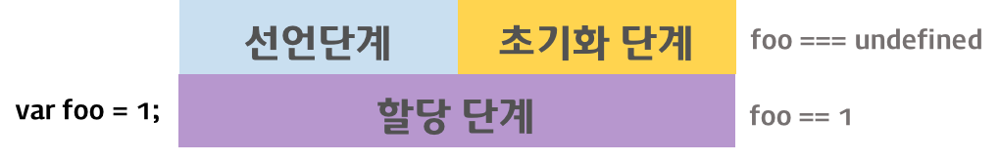

2017.07.31

# Javascript -1

## 1. Data Type (자료형)

자료형(Data Type)은 프로그래밍 언어에서 문자열, 숫자, 불리언, 객체 등 여러 종류의 데이터를 식별하는 분류를 말한다. 모든 프로그래밍 언어의 학습은 자료형을 파악하는 것으로부터 시작된다.

최신 ECMAScript 표준(ECMAScript 2015 (6th Edition, ECMA-262) / 2015.06)은 7개의 Data type을 정의한다

- 기본 자료형 (primitive data type)
  - Boolean
  - null
  - undefined
  - Number
  - String
  - Symbol (ECMAScript 6에서 추가)

- 객체형 (Object type)
  -  Object  

Javascript의 자료형은 크게 기본 자료형(primitive data type)과 객체형(참조형)으로 구분할 수 있다.

---

### 1.4 Number

C 언어의 경우, 정수형과 실수형을 구분하여 int, long, float, double 등과 같은 다양한 숫자 자료형이 존재한다. 하지만 자바스크립트는 하나의 숫자 자료형만 존재한다.

ECMAScript 표준에 따르면, 숫자 자료형은 배정밀도 64비트 부동 소수점 형 (double-precision 64-bit floating-point format : -(253 -1) 와 253 -1 사이의 숫자값) 단 하나만 존재한다. 정수만을 표현하기 위한 특별한 자료형(integer type)은 없다.

추가적으로 세가지 의미있는 기호적인 값들도 표현할 수 있다.


- +/- Infinity
- `NaN (not-a-number)` *중요

---

### 1.5 String

스트링은 작은 따옴표 또는 큰 따옴표 안에 넣어서 생성한다.
프로젝트별로 작은따옴표 또는 큰따옴표를 통일해서 작성한다.

```
"It's" 큰따옴표 안에 작은따옴표 또는 작은 따옴표 안에 큰 따옴표를 넣어 안에 스트링을 표현할 수 있다.
```

C언어와 다르게 자바스크립트 문자열은 변경 불가능(immutable)하다. 이것은 한번 문자열이 생성되면 그 문자열은 변경할 수 없다는 걸 의미한다.

---

### 1.6 Symbol

Symbol은 ES6에서 새롭게 추가된 7번째 타입이다. Symbol은 애플리케이션 전체에서 유일하며 변경 `불가능한(immutable)` 기본 자료형(primitive)이다. 주로 객체의 프로퍼티 키(property key)로 사용한다. Symbol 값은 애플리케이션 전체에서 `유일`하기 때문에 Symbol 값을 키로 갖는 프로퍼티는 다른 `어떠한 프로퍼티와도 충돌하지 않는다.`

---

### 1.7 Object type (객체형, 참조형)

객체는 데이터와 그 데이터에 관련된 동작(절차, 방법, 기능)을 모두 포함할 수 있는 개념적 존재이다. 

자바스크립트에서는 객체기반의 스크립트 언어. 모든 것은 객체이다. 기본 자료형을 제외한 나머지 값들은 모두 객체다.

- 함수
- 배열
- 날짜
- 정규식

---

## 2. 변수

애플리케이션에서 값(value)을 유지할 필요가 있을 때 변수를 사용한다.

변수는 갑을 저장, 조회, 조작하는데 사용되며 다른 사용자가 변수의 존재 목적을 쉽게 이해할 수 있도록 의미있는 이름으로 지정하여아한다.

```javascript
var score = 10; // OK
var x = 10; // NG
```

변수명은 첫번째 문자에는 영문자, 언더스코어(_), 달러($)로 시작한다. "(_)", "$"는 눈에 잘 띄니까 중요한 변수일 수 있다.

es6 버전 이전에서는 var를 써서 변수를 표현한다. 등호(=)는 변수에 값을 할당하기 위해 사용한다.
```javascript
var name = "peter"
```

변수 선언은 가급적 선두에 놓고 시작한다. 사실상 Javascript 에는 scope라는 특성 때문에 힘들 경우가 이다. eslint 툴 사용시 빨간 밑줄이 그어질 수 있는데 에러는 아니고 주의하라는 표시다.

아래는 변수 선언 방식이다.

```javascript
var name;     // 변수 name 선언
name = 'Lee'; // 변수 name에 값 'Lee'가 저장(할당)되었다.

var age = 30; // 선언과 할당

var person = 'Lee',
    address = 'Seoul',
    price = 200;

var price = 10;
var tax   = 1;
var total = price + tax;
```

C언어는 변수 선언 후 초기화를 하여야한다. 초기화하지 않으면 쓰레기 데이터가 쌓여 원하지 않은 값을 도출할 수 도 있기 때문이다. 하지만 자바스크립트는 알아서 변수 선언만 하면 undefined로 초기화 시킨다. 미선언 변수에는 ReferenceError가 발생한다.

```javascript
var x;
console.log(x); // undefined
console.log(y); // ReferenceError
```

---

### 2.1 변수의 중복 선언

변수는 중복 선언이 가능하다.
`변수의 중복 선언은 문법적으로 가능하지만 의도하지 않게 변수의 값을 변경할 수 있으므로 사용하지 않는 것이 좋다.`

```javascript
var x = 1;
console.log(x); // 1

// 변수의 중복 선언
var x = 100;
console.log(x); // 100
```

---

### 2.2 변수 선언시 var 키워드 생략 허용

변수 선언시 var 키워드를 생략할 수 있다. `이 방법은 문법적으로 허용도지만 의도하지 않게 변수를 전역(global)화 할 수 있으므로 사용하지 않는 것이 좋다.`

```javascript
x = 1;
console.log(x); // 1
```

---

### 2.3 동적 타이핑 (Dynamic Typing)

JavaScript는 동적 타입(dynamic typed) 언어 혹은 느슨한 타입(loosely typed) 언어이다. 이것은 변수의 Type annotation이 필요없이 값이 할당되는 과정에서 자동으로 자료형이 결정(Type Inference)될 것이라는 뜻이다. 따라서 `같은 변수에 여러 data type의 값을 대입할 수 있다.` 이를 동적 타이핑(Dynamic Typing)이라 한다.

`가급적 이런 돌려쓰는 데이터형 표현은 안쓰는 것이 좋다.`

```javascript
var foo;

console.log(typeof foo);  // undefined

foo = null;
console.log(typeof foo);  // object

foo = {};
console.log(typeof foo);  // object

foo = 3;
console.log(typeof foo);  // number

foo = 3.14;
console.log(typeof foo);  // number

foo = 'Hi';            
console.log(typeof foo);  // string

foo = true;                  
console.log(typeof foo);  // boolean
```

---

### 2.4 변수 호이스팅 (Variable Hoising)

```javascript
console.log(foo); // ① undefined
var foo = 123;
console.log(foo); // ② 123
{
  var foo = 456; // scope가 아님. 블록 내 범위가 아니라는 의미
}
console.log(foo); // ③ 456
```

변수는 3단계에 걸쳐 생성된다. 동시에 단계가 이뤄짐.

- `선언 단계(Declaration phase)`  
변수 객체(Variable Object)에 변수를 등록한다. 이 변수 객체는 스코프가 참조하는 대상이 된다.

- `초기화 단계(Initialization phase)`  
변수 객체(Variable Object)에 등록된 변수를 메모리에 할당한다. 이 단계에서 변수는 undefined로 초기화된다.

- `할당 단계(Assignment phase)`  
undefined로 초기화된 변수에 실제값을 할당한다.

var 키워드로 선언된 변수는 선언 단계와 초기화 단계가 한번에 이루어진다. 즉, 스코프에 변수가 등록되고 변수는 메모리에 공간을 확보한 후 undefined로 초기화된다. 따라서 변수 선언문 이전에 변수에 접근하여도 Variable Object에 변수가 존재하기 때문에 에러가 발생하지 않는다. 다만 undefined를 반환한다. 이러한 현상을 변수 호이스팅(Variable Hoisting)이라한다.

이후 `변수 할당문에 도달하면 비로서 값의 할당`이 이루어진다.



---

### 2.6 var 키워드로 선언된 변수의 문제점

`ES5`에서 변수를 선언할 수 있는 유일한 방법은 var 키워드를 사용하는 것이다. var 키워드로 선언된 변수는 아래와 같은 특징을 갖는다. 이는 다른 C-family 언어와는 차별되는 특징(설계상 오류)으로 주의를 기울이지 않으면 심각한 문제를 발생시킨다.

- `Function-level scope`
  - 전역 변수의 남발
  - **for loop 초기화식에서 사용한 변수를 for loop 외부 또는 전역에서 참조할 수 있다.**

- `var 키워드 생략 허용`
  - 의도하지 않은 변수의 전역화

- `중복 선언 허용`
  - 의도하지 않은 변수값 변경

- `변수 호이스팅`
  - 변수를 선언하기 전에 참조가 가능하다.

대부분의 문제는 전역 변수로 인해 발생한다. 전역 변수는 간단한 애플리케이션의 경우, 사용이 편리한 면이 있지만 불가피한 상황을 제외하고 사용을 억제해야 한다. `전역 변수는 범위(scope)가 넓어서 어디에서 어떻게 사용될 지 파악하기 힘들다.` 이는 의도치 않은 변수의 변경이 발생할 수 있는 가능성이 증가한다. 또한 여러 함수와 상호 의존하는 등 side effect가 있을 수 있어서 복잡성이 증가한다.

따라서 `변수의 범위(scope)는 좁을수록 좋다.`

`ES6`는 이러한 var의 단점을 보완하기 위해 `let`과 `const` 키워드를 도입하였다.

---

## 3. 연산자

### 3.1 산술연산자

```javascript
var x = 5;
var y = 2;
var z;

z = x + y;  // 7
z = x - y;  // 3
z = x * y;  // 10
z = x / y;  // 2.5
z = x % y;  // 1
z = x++;    // *5 선대입후증가*
z = ++x;    // *7 선증가후대입*
z = x--;    // *7 선대입후감소*
z = --x;    // *5 선감소후대입*

var str1 = '5' + 5;      // '55' <- 문자열
var str2 = 5 + '5';      // '55' <- 문자열
var str3 = 'Hello' + 5;  // 'Hello5' <- 문자열
// 위와 같은 행동은 하지 말아야 함!
```

"+" 연산자는 덧셈 연산과 문자열 연결 연산을 수행한다. 
연산 대상이 모두 숫자인 경우 : 덧셈 연산
그 외의 경우 : 문자열 연결 연산

---

### 3.2 대입 연산자

```javascript
var x;

x = 10;   // 10
x += 5;   // 15
x -= 5;   // 10
x *= 5;   // 50
x /= 5;   // 10
x %= 5;   // 0

var txt1 = 'Good';
var txt2 = 'Morning';
var txt3 = txt1 + ' ' + txt2; // Good Morning

txt1 = 'What a very ';
txt1 += 'nice day'; // What a very nice day
```

---

### 3.3 비교연산자

```javascript
var x = 5;

x == 5    // true
x == '5'  // true
x == 8    // false

x === 5   // true
x === '5' // false

x != 8    // true
x != 5    // false
x != '5'  // false

x !== 8   // true
x !== 5   // false
x !== '5' // true

x > 0     // true
x > 5     // false
x > 8     // false

x < 0     // false
x < 5     // false
x < 8     // true

x >= 0    // true
x >= 5    // true
x >= 8    // false

x <= 0    // false
x <= 5    // true
x <= 8    // true

// 삼항연산자(ternary operator)
// 조건 ? 조건이 ture일때 반환할 값 : 조건이 false일때 반환할 값
var condition = true;
var result = condition ? 'true' : 'false';
console.log(result); // 'true'

// id의 길이가 INPUT_ID_MIN_LEN보다 작으면 에러 메시지를 출력한다.
var id = 'lee';
var INPUT_ID_MIN_LEN = 5;
var errMsg = id.length < INPUT_ID_MIN_LEN ? '아이디는 5자리 이상으로 입력하세요' : '성공';
console.log(errMsg); // '아이디는 5자리 이상으로 입력하세요'

// "."을 찍는 순간 wrapper 객체가 순간적으로 생성되서 .length 라는 키워드를 사용해 문자열 길이를 확인할 수 있다.
```

---

### 3.4 논리 연산자

```javascript
// || (논리 합) 연산자
var o1 =  true || true;     // t || t returns true
var o2 = false || true;     // f || t returns true
var o3 =  true || false;    // t || f returns true
var o4 = false || (3 == 4); // f || f returns false

// && (논리곱) 연산자
var a1 =  true && true;     // t && t returns true
var a2 =  true && false;    // t && f returns false
var a3 = false && true;     // f && t returns false
var a4 = false && (3 == 4); // f && f returns false

// ! (논리 부정) 연산자
var n1 = !true;  // false
var n2 = !false; // true
var n3 = !'Cat'; // false
```

---

### 3.5 단축 평가

평가식	평가 결과
- true || anything :	`true`
- false || anything	: `anything`
- true && anything	: `anything`
- false && anything	: `false`

```javascript
// || (논리 합) 연산자
var o1 = 'Cat' || 'Dog';    // t || t returns Cat
var o2 = false || 'Cat';    // f || t returns Cat
var o3 = 'Cat' || false;    // t || f returns Cat 

// && (논리곱) 연산자
var a1 = 'Cat' && 'Dog';    // t && t returns Dog
var a2 = false && 'Cat';    // f && t returns false
var a3 = 'Cat' && false;    // t && f returns false 

// if문 쓸 때 활용할 수 있음
```

--- 

### 3.6 타입 연산자

```javascript
typeof 'John'                 // returns string
typeof 3.14                   // returns number
typeof NaN                    // returns number
typeof false                  // returns boolean
typeof [1, 2, 3, 4]           // returns object
typeof {name:'John', age:34}  // returns object
typeof new Date()             // returns object
typeof function () {}         // returns function
typeof myCar                  // returns undefined (설계적 결함)
typeof null                   // returns object (설계적 결함)

function Person(){}
var me = new Person()
me instanceof Person // returns true
```

---

### 3.7 !!

`!!`의 역할은 피연산자를 불린값으로 변환하는 것이다. 즉 자료형 변환을 하지 않아도 느낌표 두개 (!!)로 불린 값으로 변경시켜 true 또는 false로 값을 반환할 수 있다.

```javascript
console.log(!!1);         // true
console.log(!!0);         // false
console.log(!!'string');  // true
console.log(!!'');        // false
console.log(!!null);      // false
console.log(!!undefined); // false
console.log(!!{});        // true
console.log(!![]);        // true
```

객체(배열 포함)의 경우 빈 객체라도 존재하기만하면 true로 변환된다.

객체의 존재 확인 후 그 결과를 반환해야 하는 경우, !!를 사용하면 강제로 피연산자를 boolean으로 형 변환 할 수 있다.

```javascript
var obj;
console.log(!!obj); // false

obj = {};
console.log(!!obj); // true
```

---

## 4. 제어문

### 4.1 블록구문

블록 구문(Block statement)는 구문들의 집합으로 가장 기본이 되는 구문이다. (블록은 중괄호로 그 범위를 정한다) 블록 구문은 일반적으로 함수, 객체리터럴, 흐름 제어 구문(control flow statement)에서 사용된다. (e.g. if, for, while)

---

### 4.2 조건문

데이터의 흐름을 제어한다는 것은 일정 조건에 따른 의사결정(decision)을 통해 다음 진행 흐름으로 유도(Control flow)하는 것이다. 이는 가장 원시적인 형태의 인공 지능(Artificial Intelligence)을 부여하는 것이라고 볼 수 있다. 즉 의사결정(상황판단)의 기준을 제시하고 그 결과에 따른 행위를 지시하는 것이다.

조건문(conditional statement)를 통해 이를 수행할 수 있다. 조건문은 주어진 조건식(conditional expression)이 `참(true)`인지 `거짓(false)`인지에 따라 실행되어질 구문들의 집합이다.

JavaScript는 2가지의 조건문 if...else 와 switch를 제공한다.

---

### 4.2.1 if문

```javascript
var hour = 20;
var greeting;

// if 문
if (hour < 18) {
  greeting = 'Good day';
}

console.log(greeting);

// if-else 문
if (hour < 18) {
  greeting = 'Good day';
} else {
  greeting = 'Good evening';
}

console.log(greeting);

// if-else if 문
if (hour < 10) {
  greeting = 'Good morning';
} else if (hour < 20) {
  greeting = 'Good day';
} else {
  greeting = 'Good evening';
}

console.log(greeting);
```

--- 

### 4.2.2 switch문

switch 문의 경우, switch변수의 값과 일치되는 case문으로 실행 순서가 이동하게 된다. switch변수의 값과 일치되는 case문이 없다면 실행 순서는 default로 이동한다.

```javascript
var color = 'red';

// color = switch 변수
switch (color) {
  // color == 'yellow'인 경우
  case 'yellow':
    console.log('yellow color');
  // color == 'red'인 경우
  case 'red':
    console.log('red color');
  // color == 'blue'인 경우
  case 'blue':
    console.log('blue color');
  // 그외의 경우
  default:
    console.log('unknown color');
}
```

break keyword는 switch 구문에서 탈출하는 역할을 수행한다. break문이 없다면 case문의 조건과 일치하지 않더라도 실행 순서는 다음 case문으로 이동한다.

따라서 위 코드는 red color, blue color, unknown color가 콘솔에 찍히게 된다.

아래처럼 break 키워드를 써서 더이상 switch 구문이 돌지 않도록 해야 한다.


```javascript
var color = 'red';

switch (color) {
  case 'yellow':
    console.log('yellow color');
    break;
  case 'red':
    console.log('red color');
    break;
  case 'blue':
    console.log('blue color');
    break;
  default:
    console.log('unknown color');
}
```

`default문에는 break를 생략하여도 무방하다.` 이유는 default문이 가장 마지막에 위치하므로 다음 구문으로 이동할 수 없기 때문이다.

---

## 4.3 반복문

반복문은 주어진 조건식(conditional expression)이 참인 경우 코드 블록을 실행한다.

그 후 조건식을 다시 검사하여 여전히 참인 경우 코드 블록을 다시 실행하며 이는 조건식이 거짓일 때까지 반복된다.

JavaScript는 3가지의 반복문 `for, while, do while`을 제공한다.

---

### 4.3.1 for문

for문은 특정 조건이 거짓으로 판별될 때까지 반복한다. 가장 일반적으로 사용되는 반복문이다.

```javascript
for ([초기식]; [조건식]; [증감식]) {
  구문;
}

for (var i = 0; i < 2; i++) {
  console.log(i);
} // ++

for (var i = 1; i >= 0; i--) {
  console.log(i);
} // --
```

다음은 for문의 다양한 예다.

```javascript
var array = ['one', 'two', 'three', 'four'];

for (var i = 0; i < array.length; i++) {
  // console.log(array[i]);
  console.log('[' + i + '] = ' + array[i]);
}

// for-in
for (var index in array) {
  console.log('[' + index + '] = ' + array[index]);
}

// foreach
array.forEach(function (element, index, arr) {
  console.log('[' + index + '] = ' + element);
});

// for-of (ES6)
for (const element of array) {
  console.log(element);
}
// array.entries(): 배열의 key/value의 쌍을 반환하는 iterator를 반환
for (const [index, value] of array.entries()) {
  console.log('[' + index + '] = ' + value);
}
```
for문의 모든 식은 선택 사항이며 반드시 사용할 필요는 없다. 아래 처럼 어떤 식도 선언하지 않으면 무한루프가 된다.

```javascript
var i = 0;
for (;;) { // 무한루프
  if (i >= 3) {
    break;
  }
  console.log(i);
  i++;
}
```

---

### 4.3.2 while문

while 문은 조건문이 참이면 코드 블럭을 계속해서 반복 실행한다. 조건문이 거짓이 되면 실행을 종료하고 반복문을 빠져나간다.

```javascript
var n = 0;
var x = 0;

// n이 3보다 작을 때까지 계속 반복한다.
while (n < 3) { // n: 0 1 2 ( ) 비어이으면 무한루프
  n++;          // n: 1 2 3 이숫자 빼면 무한루프
  x += n;       // x: 1 3 6
  console.log(x);
}
```

조건이 언제나 참이면 무한루프 한다. ex) 횡스크롤 게임에서 뒷 배경이 계속 도는 것.

```javascript
var i = 0;
// 무한루프
while (true) {
  console.log(i);
  i++;
}
```

무한루프를 탈출하기 위해서는 break문을 사용한다. break문을 감싸는 반복문 하나를 탈출한다.

```javascript
var i = 0;
// 무한루프
while (true) {
  console.log(i);
  i++;
  // i가 10이면 exit!
  if (i === 10) break;
}
```

---

### 4.3.3 do while문

while문과 유사하나 코드블록은 조건문을 확인하기 전에 무조건 1회 실행된다. 그후 조건문을 확인하여 실행 여부를 판별한다.

```javascript
var i = 0;
do {
  console.log(i);
  i++;
} while (i < 3);
```

---

### 4.3.4 continue

break문은 반복문 하나를 탈출한다. continue문은 이후 구문의 실행을 스킵하고 반복문의 조건문으로 이동한다.

```javascript
for (var i = 0; i < 5; i++) {
  if (i % 2 == 0) continue;
  console.log(i);
} // 결국 홀수만 출력하게 되는 구문
```

---

## 5. 평가문

흐름제어를 위해서는 조건식을 평가하여 논리적 참, 거짓을 구별한 후 평가 결과에 따라 의사결정을 하는 것이 일반적이다.

조건식(conditional expression)은 표현식(expression)의 일종이다. 따라서 피연산자와 이항연산자로 구성된 일반적 표현식뿐만 아니라 문자열이나 숫자와 같은 리터럴 값, 변수, 내장값들(true, false, null, undefined, Nan, Infinity…)등 또한 조건식으로 사용될 수 있다.

빈번하게 사용된다.

```javascript
if (1) {
  console.log('1');
}

if ('str') {
  console.log('2');
}

if (true) {
  console.log('3');
}

if (null) {
  console.log('4');
}

var x = '';

if (x) {
  console.log('5');
}

if (!x) {
  console.log('6');
}
```

이때 자바스크립트는 암묵적 강제 형 변환을 통해 조건식을 평가한다.

---

### 5.1 암묵적 강제 형 변환

javascript는 문맥을 고려하여 내부적으로 자료형을 암묵적으로 강제 변환하여 작업을 할 수 있다. 하지만 이러한 방법은 되도록 하지 않는다.
부정적인 값, 0 등 이런 값들은 대부분 false로 처리된다.

```javascript
console.log('1' > 0);            // true
console.log(1 + '2');            // '12'
console.log(2 - '1');            // 1
console.log('10' == 10);         // true
console.log('10' === 10);        // false
console.log(undefined == null);  // true
console.log(undefined === null); // false
```

---


### 5.2 Data type conversion

```javascript
// 아래는 자주 사용되는 구문임.
var val = '123';
console.log(typeof val + ': ' + val); // string: 123

// sting -> number
val *= 1;
// val = Number(val);
// val = parseInt(val);
console.log(typeof val + ': ' + val); // number: 123

// number -> sting 
val += '';
// val = String(val);
console.log(typeof val + ': ' + val); // string: 123
```

---

### 5.3 Truthy & Falsy Values

아래 값들은 Boolean context에서 false로 평가된다.

```javascript
var x = false;
if (!x)  console.log(x+' is falsy value');

x = undefined;
if (!x)  console.log(x+' is falsy value');

x = null;
if (!x)  console.log(x+' is falsy value');

x = 0;
if (!x)  console.log(x+' is falsy value');

x = NaN;
if (!x)  console.log(x+' is falsy value');

x = '';
if (!x)  console.log(x+' is falsy value');
```

---

### 5.4 Checking equality

```javascript
// logs false !!!
console.log(null == false);
console.log(undefined == false);
console.log(null == 0);
console.log(undefined == 0);
console.log(undefined === null);
console.log(NaN == null);
console.log(NaN == NaN);
```
두 값을 비교할 때에 동등연산자(==, !=)보다 일치연산자(===, !==)를 사용하여야 한다.

---

### 5.5 Checking existence

단항 연산자를 활용한 존재 확인이 가능하다. 즉, 객체나 배열(배열도 객체이다)이 값을 가지고 있으면 truthy value로 취급된다.받는다. 이를 이용하여 존재여부를 확인할 수 있다.

```javascript
if (document.getElementById('header')) {
  // 요소가 존재함 : 필요한 작업을 수행
} else {
  // 요소가 존재하지 않음 : 필요한 작업을 수행
}
```

아래 예는 위의 예와는 다른 의미이다. 객체의 존재는 truthy value로 취급지만 boolean 값 true와 같지는 않다.

```javascript
if (document.getElementById('header') == true) // false
```

아래 예와 같은 경우를 주의해야 한다.

```javascript
var b = new Boolean(false);
if (b) // true
```

---

## 6. 객체(Object)

자바스크립트는 객체(object)기반의 스크립트 언어이며 자바스크립트를 이루고 있는 거의 “모든 것”은 객체이다. 기본자료형(Primitives)을 제외한 나머지 값들(함수, 배열, 정규표현식 등)은 모두 객체이다.

객체는 데이터와 그 데이터에 관련되는 동작(절차, 방법, 기능)을 모두 포함할 수 있는 개념적 존재이다. 달리 말해, 이름(키)과 값으로 구성된 데이터를 의미하는 프로퍼티(property)와 동작을 나타내는 메서드(method)를 포함하고 있는 독립적 주체이다.

객체는 데이터를 한 곳에 모으고 구조화하는데 유용하다. 객체 하나는 다른 객체를 포함할 수 있기 때문에 그래프나 트리와 같은 자료구조를 쉽게 표현할 수 있다.

---

### 6.1 프로퍼티(property)

- 프로퍼티 이름 : 빈 문자열을 포함하는 문자열과 숫자
- 프로퍼티 값 : undefined을 제외한 모든 값

---

### 6.2 메서드(Method)

메서드는 객체에 제한되어 있는 함수를 의미한다. 즉 프로퍼티 값이 함수일 경우, 일반 함수와 구분하기 위해 메서드라 칭한다.

---

### 6.3 객체 생성방법

자바에서는 클래스를 사전에 정의하고 필요한 시점에 new 연산자를 사용하여 인스턴스를 생성하는 방식으로 객체를 생성한다. 하지만 자바스크립트는 클래스라는 개념이 없고 별도의 객체 생성 방법이 존재한다.

> ECMAScript 6에서 새롭게 클래스가 도입되었다. 프로토타입 기반 프로그래밍은 클래스가 존재하지 않는 객체지향 프로그래밍 스타일로 프로토타입 체인과 클로저 등으로 객체 지향 언어의 상속, 캡슐화(정보 은닉) 등의 개념을 구현할 수 있다. 하지만 class 기반 언어에 익숙한 프로그래머들은 혼란을 일으킬 수 있으며 JavaScript를 어렵게 느끼게하는 하나의 장벽처럼 인식되었다. ES6의 Class는 기존 prototype 기반 객체지향 프로그래밍보다 Class 기반 언어에 익숙한 프로그래머가 보다 빠르게 학습할 수 있는 단순하고 깨끗한 새로운 문법을 제시하고 있다. ES6의 Class가 새로운 객체지향 모델을 제공하는 것이 아니며 Class도 사실 함수이고 기존 prototype 기반 패턴의 Syntactic sugar이다.

--- 

#### 6.3.1 객체 리터럴

가장 일반적이고 간편한 자바스크립트의 객체 생성 방식이다.

중괄호({})를 사용하여 객체를 생성하는데 {} 내에 아무것도 기술하지 않으면 빈 객체가 생성된다. {} 내에 1개 이상의 프로퍼티 이름(Property name): 프로퍼티 값(Property value)을 기술하면 해당 프로퍼티가 추가된 객체를 생성할 수 있다.

`소수의 객체를 만들 때 유용`하다.

`객체 리터럴은 object 생성자 함수의 숏텐드`

```javascript
var emptyObject = {};
console.log(typeof emptyObject); // object

var person = {
  name: 'Lee',
  gender: 'male',
  sayHello: function () {
    console.log('Hi! My name is ' + this.name);
  } 
  // person의 값은 객체 리터럴
  // this 는 person을 가리킴
  // this는 객체 리터럴에 의해 자신을 가리킴
};

console.log(typeof person); // object
console.log(person); // { name: 'Lee', gender: 'male', sayHello: [Function: sayHello] }

person.sayHello(); // Hi! My name is Lee
```

객체 리터럴에 의한 객체 생성 방식의 특징은 생성자 함수를 사용한 객체 생성 방식과는 달리 new 연산자를 사용할 필요없이 선언과 동시에 인스턴스가 생성된다는 것이다.

---

#### 6.3.2 Object() 생성자 함수

new 연산자와 `Object() 생성자 함수`를 사용하여 빈 객체를 생성할 수 있다. 빈 객체 생성 이후 프로퍼티와 메서드를 추가하여 객체를 완성하는 방법이다.

객체의 프로퍼티에 새로운 값을 할당하면 프로퍼티 값은 갱신된다. 객체가 소유하고 있지 않은 프로퍼티에 값을 할당하면 해당 객체에 프로퍼티를 추가하고 값을 할당한다.

java와 비슷한 문법을 흉내 낸 것으로 잘 쓰이지 않는 방법이다.

```javascript
// 빈 객체의 생성
var person = new Object();

// 프로퍼티 추가
person.name = 'Lee';
person.gender = 'male';
person.sayHello = function () {
  console.log('Hi! My name is ' + this.name);
};

console.log(typeof person); // object
console.log(person); // { name: 'Lee', gender: 'male', sayHello: [Function] }

person.sayHello(); // Hi! My name is Lee
```

---

#### 6.3.3 생성자 함수

객체 리터럴 방식과 Object() 생성자 함수 방식으로 객체를 생성하는 것은 프로퍼티 값만 다른 여러개의 객체 생성에 불편이 있다. 동일한 프로퍼티를 갖는 객체임에도 불구하고 매번 아래와 같은 프로퍼티를 기술해야한다. 

```javascript
var person1 = {
  name: 'Lee',
  gender: 'male',
  sayHello: function () {
    console.log('Hi! My name is ' + this.name);
  }
};

var person2 = {
  name: 'Kim',
  gender: 'female',
  sayHello: function () {
    console.log('Hi! My name is ' + this.name);
  }
};
```

따라서 아래코드 처럼 생성자 함수를 사용하면 마치 객체를 생성하기 위한 템플릿(클래스)처럼 사용하여 구성이 동일한 객체 여러개를 간편하게 생성할 수 있다. 
`반복 활동을 줄일 수 있어 여러개 만들 때 유용하다.`

함수 이름의 첫 문자를 대문자로 만드는 관습이 있다.

```javascript
// 생성자 함수
function Person(name, gender) {
  this.name = name;
  this.gender = gender;
  this.sayHello = function(){
    console.log('Hi! My name is ' + this.name);
  };
}

// 인스턴스의 생성
var person1 = new Person('Lee', 'male');
var person2 = new Person('Kim', 'female');

console.log('person1: ', typeof person1);
console.log('person2: ', typeof person2);
console.log('person1: ', person1);
console.log('person2: ', person2);

person1.sayHello();
person2.sayHello();
```

---

### 6.4 객체 프로퍼티 접근

#### 6.4.1 프로퍼티 이름

프로퍼티 이름에는 문자열(빈 문자열 포함)과 숫자가 올 수 있다. 그리고 프로퍼티 값은 undefined을 제외한 모든 값과 표현식이 올 수 있으며 프로퍼티 값이 함수인 경우 이를 메서드라 한다.

프로퍼티 이름의 따옴표(‘’ 또는 ““)는 자바스크립트에서 사용할 수 있는 유효한 이름이고 예약어가 아닌 경우 생략할 수 있다. 반대로 말하면 자바스크립트에서 사용할 수 있는 유효한 이름이 아닌 경우 반드시 따옴표를 사용하여야 한다.

```javascript
var person = {
  'first-name': 'Ung-mo',
  'last-name': 'Lee', // -를 쓰면 안된다 키워드이기 때문
  // _를 쓰면 따옴표를 떼도 된다.
  // 또는 lastName 처럼 쓰면 따옴표를 떼도 된다.
  // 대부분 스네이크 케이스, 카멜 케이스를 사용.
  
  gender: 'male',

  function: 1 // OK. 하지만 예약어는 사용하지 말아야 한다.
};

console.log(person.function);
```

프로퍼티 이름 first-name에는 반드시 따옴표를 사용해야 하지만 first_name에는 생략 가능하다. 이는 first-name은 자바스크립트에서 사용 가능한 유효한 이름이 아니라 ‘-‘ 연산자가 있는 표현식이기 때문이다.

예약어를 프로퍼티 이름으로 사용하여도 에러가 발생하지는 않는다. 하지만 예상치 못한 에러가 발생할 수 있으므로 예약어를 프로퍼티 이름으로 사용하여서는 않된다.

변수명 또는 프로퍼티명이 약간 길어지더라도 정체를 알 수 있도록 이름을 지어야한다. `대개 변수는 명사로 메소드는 동사+목적어로 짓는다.`

자바스크립트 예약어는 아래와 같다.

```
abstract	arguments	boolean	break	byte
case  catch	char	class*	const
continue	debugger	default	delete	do
double	else	enum*	eval	export*
extends*	false	final	finally	float
for	function	goto	if	implements
import*	in	instanceof	int	interface
let	long	native	new	null
package	private	protected	public	return
short	static	super*	switch	synchronized
this	throw	throws	transient	true
try	typeof	var	void	volatile
while	with	yield
// *는 ES6에서 추가된 예약어
```

---

#### 6.4.2 프로퍼티 값 읽기

객체의 프로퍼티에 접근하려면 아래와 같이 두가지 방법을 사용한다.

- 마침표(.) 표기법
- 대괄호([]) 표기법

```javascript
var person = {
  'first-name': 'Ung-mo',
  'last-name': 'Lee',
  gender: 'male',
};

console.log(person);

console.log(person.first-name);    // NaN: undefined-name
console.log(person[first-name]);   // ReferenceError: first is not defined
console.log(person['first-name']); // 'Ung-mo'
// 프로퍼티 명이 ("") 따옴표로 감싸져 있으면 [] 대괄호 안에 "" 따옴표를 넣어야 프로퍼티 명을 읽어서 값을 가져올 수 있다.

console.log(person.gender);    // 'male'
console.log(person[gender]);   // ReferenceError: gender is not defined
console.log(person['gender']); // 'male'
```

프로퍼티 이름이 유효한 자바스크립트 이름이고 예약어가 아닌 경우 프로퍼티 값은 마침표 표기법, 대괄호 표기법 모두 사용할 수 있다.

프로퍼티 이름이 유효한 자바스크립트 이름이 아니거나 예약어인 경우 프로퍼티 값은 대괄호 표기법으로 읽어야 한다. 대괄호([]) 표기법을 사용하는 경우, 대괄호 내에 들어가는 프로퍼티 이름은 반드시 문자열이어야 한다.

객체에 존재하지 않는 프로퍼티를 참조하면 undefined를 반환한다.

```javascript
var person = {
  'first-name': 'Ung-mo',
  'last-name': 'Lee',
  gender: 'male',
};

console.log(person.age); // undefined
```

---

#### 6.4.3 프로퍼티 값 갱신

객체가 소유하고 있는 프로퍼티에 새로운 값을 할당하면 프로퍼티 값은 갱신된다.

```javascript
var person = {
  'first-name': 'Ung-mo',
  'last-name': 'Lee',
  gender: 'male',
};

person['first-name'] = 'Kim';
console.log(person['first-name'] ); // 'Kim'
```

---

#### 6.4.4 프로퍼티 동적 생성

객체가 소유하고 있지 않은 프로퍼티에 값을 할당하면 하면 해당 프로퍼티를 객체에 추가하고 값을 할당한다.

```javascript
var person = {
  'first-name': 'Ung-mo',
  'last-name': 'Lee',
  gender: 'male',
};

person.age = 20;
console.log(person.age); // 20
```

---

#### 6.4.5 프로퍼티 삭제

delete 연산자를 사용하면 객체의 프로퍼티를 삭제할 수 있다.

```javascript
var person = {
  'first-name': 'Ung-mo',
  'last-name': 'Lee',
  gender: 'male',
};

delete person.gender;
console.log(person.gender); // undefined

delete person;
console.log(person); // Object {first-name: 'Ung-mo', last-name: 'Lee'}
```

---

#### 6.4.6 for in문

for-in 문을 사용하면 객체에 포함된 모든 프로퍼티에 대해 루프를 수행할 수 있다.

`ES6 에서는 for of 문이 있어서 되도록 안쓰는게 좋다.`

```javascript
var person = {
  'first-name': 'Ung-mo',
  'last-name': 'Lee',
  gender: 'male'
};

for(var prop in person) {
  console.log(prop + ': ' + person[prop]);
}

/*
first-name: Ung-mo
last-name: Lee
gender: male
*/
```

---

#### 6.4.7 Pass-by-reference

기본자료형 object를 객체형 또는 참조형이라 한다. 참조형이란 객체의 모든 연산이 실제값이 아닌 참조값으로 처리됨을 의미한다.

이에 반해 기본자료형의 값은 값(value)으로 전달된다. 즉, 복사되어 전달된다. 이를 pass-by-value라 한다.

기본자료형은 값이 한번 정해지면 변경할 수 없지만(immutable), 객체는 변경 가능한 프로퍼티들의 집합이라 할 수 있다.

immutable에 대한 상세한 내용은 객체와 변경불가성(Immutability)을 참조하기 바란다.

`객체로 만든 것은 복사되지 않고 똑같은 주소를 참조하기 때문에 바로 값이 변경 된다.`

```javascript
// Pass-by-reference
var foo = {
  val: 10
}

var bar = foo;
console.log(foo.val, bar.val); // 10 10
console.log(foo === bar);      // true

bar.val = 20;
console.log(foo.val, bar.val); // 20 20
console.log(foo === bar);      // true
```

---

#### 6.4.8 객체의 분류

- 내장 객체
  - Standard Built-in Objects (or Global Objects)
  - BOM (Browser Object Model)
  - DOM (Document Object Model)

- 사용자 정의 객체
  - 사용자가 생성한 객체 들이다. constructor 혹은 객체리터럴을  통해 사용자가 객체를 정의하고 확장시킨 것들이기 때문에 Built-in Object 와 Native Object가 구성된 이후에 구성된다.