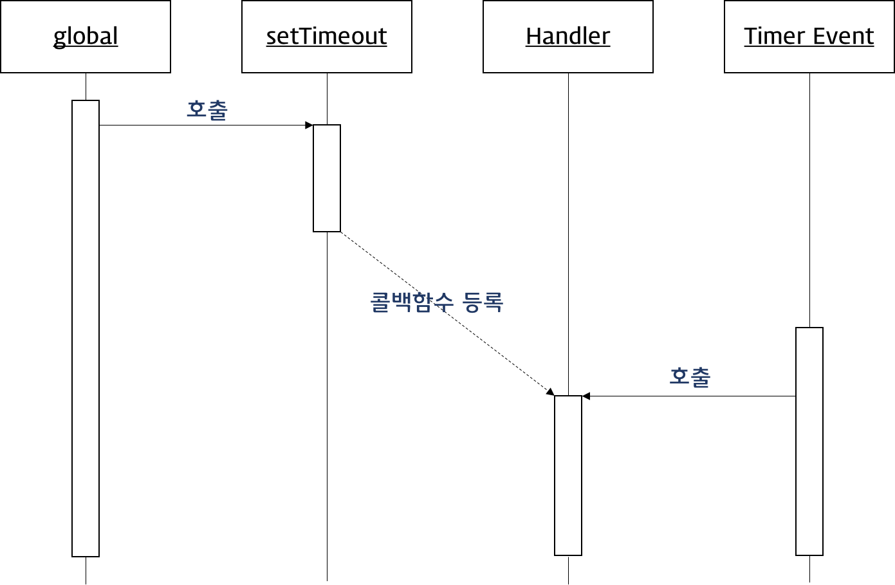

2017.08.01

# Javascript -2

## 1. 객체와 변경불가성(Immutability)

기본자료형는 메모리 할당량이 적지만 객체는 메모리 할당이 높다.

---

### 1.1 immutable value vs. mutable value

기본 자료형 이외의 모든 값은 객체(Object) 타입이며 객체 타입은 변경 가능한 값(mutable value)이다. 즉 객체는 새로운 값을 다시 만들 필요없이 직접 변경이 가능하다는 것이다.

예를 들어 살펴보자. C 언어와는 다르게 Javascript의 문자열은 변경 불가능한 값(immutable value) 이다. 이런 값을 “primitive values” 라 한다. (변경이 불가능하다는 뜻은 메모리 영역에서의 변경이 불가능하다는 뜻이다. 재할당은 가능하다)

---

### 1.2 불변 데이터 패턴(immutable data pattern)

- 객체의 방어적 복사(defensive copy)  
  Object.assign

- 불변객체화를 통한 객체 변경 방지  
  Object.freeze
`추가 공부 필요` 

--- 

## 2. 함수

- 함수란 어떤 특정 작업을 수행하기 위해 필요한 일련의 구문들을 그룹화하기 위한 개념이다. 만일 스크립트의 다른 부분에서도 동일한 작업을 반복적으로 수행해야 한다면 (동일한 구문을 계속해서 반복 작성하는 것이 아니라) 미리 작성된 함수를 재사용할 수 있다.`(코드의 재사용)`

- 함수를 호출하여 필요한 값을 전달

- 함수도 객체(일급 객체 First-class Object)이므로 다른 값들 처럼 사용할 수 있다.

---

### 2.1 함수 정의

함수를 정의하는 방식은 3가지가 있다.

****명칭 중요***

- `함수선언식(Function declaration)`
- `함수표현식(Function expression)`
- `Function() 생성자 함수`

---

#### 2.1.1 함수선언식

- 함수 선언식은 함수명 생략 불가
- 함수명은 함수 몸체에서 자신을 재귀적 호출 가능
- 자바스크립트 디버거가 해당함수를 구분할 수 있는 식별자 역할
- 매개변수는 0개 이상의 목록으로 괄호로 감싸고 콤마로 분리
- 다른 언어와 차이점은 매개변수의 자료형을 기술하지 않아서 `자료형 체크가 중요`
- ex) typeof num === 'number' && !!num
- 함수블록은 하나의 스코프(scope)
- return 뒤에 구문이 없으면 undefined를 반환해서 아무것도 안한다.
- return 뒤에는 최종적으로 반환할 값만 씀. 생략도 가능(그럼 문제가 생길 수 있음)

```javascript
function square(number) { // {}함수(펑션) 바디(몸체), number는 파라미터(매개변수), square는 함수명
  return number * number; // return은 함수를 호출한 곳으로 반환한다. number*number은 반환문
}
```

---

#### 2.1.2 함수표현식

- 변수에 함수표현식이 들어간 거
- 함수 리터럴이라고도 부름.
- 변수명이 있으니까 함수명을 안쓴다. 함수명을 안쓰면 무명 또는 익명함수표현식, 함수명을 쓰면 기명함수표현식
- 재귀함수, 디버거 때문에 쓰인다.
- 함수호출시 변수명을 통해서 부른다.

```javascript
// 함수표현식
var foo = function(number) {
  return number * number
}

// 기명 함수표현식(named function expression)
var foo = function multiply(a, b) {
  return a * b;
};

// 익명 함수표현식(anonymous function expression)
var bar = function(a, b) { // a, b는 인자
  return a * b;
};

var bar = foo;

console.log(foo(10, 10)); // 100 (10, 10)는 인수, 아규먼트
console.log(bar(10, 10)); // 100
```

- 함수선언식으로 정의한 square()의 경우, 함수명으로 호출할 수 있었는데 이는 자바스크립트 엔진에 의해 아래와 같은 함수표현식으로 형태가 변경되었기 때문이다.

```javascript
var square = function square(number) {
  return number * number
}
```

`결국 함수선언식도 함수표현식과 동일하게 함수 리터럴 방식으로 정의되는 것이다.`

---

#### 2.1.3 Function() 생성자 함수

함수선언식과 함수표현식은 모두 함수 리터럴 방식으로 함수를 정의하는데 이것은 결국 내장 함수 Function() 생성자 함수로 함수를 생성하는 것을 단순화 시킨 것이다.

`잘 안쓰이는 방식이고 자바스크립트 엔진이 이런 방식으로 구동되는 것이다.` 오브젝트 생성자 함수랑 똑같다.

```javascript
var square = new Function('number', 'return number * number');
console.log(square(10)); // 100
```

---

### 2.2 함수 호이스팅

```javascript
var res = square(5);

function square(number) {
  return number * number;
}
```

호이스팅이란 var 선언문이나 function 선언문 등을 해당 Scope의 맨 위로 옮기는 것을 말한다. 즉 자바스크립트는 코드를 실행하기 전에 var 선언문과 function 선언문을 해당 스코프의 맨위로 옮긴다.

`따라서 함수선언식은 안쓰는 것이 좋다`

```javascript
var res = square(5); // TypeError: square is not a function
// var square가 변수로 처리되어 변수 호이스팅으로 인해 변수 선언이 상단에 배치돼 타입에러가 난다.

var square = function(number) {
  return number * number;
}
```

---

### 2.3 First-class object (일급 객체)

일급 객체(first-class object)란 생성, 대입, 연산, 인자 또는 반환값으로서의 전달 등 프로그래밍 언어의 기본적 조작을 제한없이 사용할 수 있는 대상을 의미한다.

다음 조건을 만족하면 일급 객체로 간주한다.

- 무명의 리터럴로 표현이 가능하다.
- 변수나 자료 구조(객체, 배열…)에 저장할 수 있다.
- 함수의 파라미터로 전달할 수 있다.
- 반환값(return value)으로 사용할 수 있다.

```javascript
// 1. 무명의 리터럴로 표현이 가능하다.
// 2. 변수나 데이터 구조안에 담을 수 있다.
var increase = function(num) {
  return num + 1;
};

var decrease = function(num){
  return num - 1;
};

var obj = {
  increase: increase,
  decrease: decrease
};

// 2. 함수의 파라미터로 전달 할 수 있다.
function calc(func, num){
  return func(num);
}

console.log(calc(increase, 1));
console.log(calc(decrease, 1));

// 3. 반환값(return value)으로 사용할 수 있다.
function calc(mode){
  var funcs = { // scope가 좁게 쓰인 예
    plus:  function(left, right){ return left + right; },
    minus: function(left, right){ return left - right; }
  };
  return funcs[mode];
}
console.log(calc('plus')(2,1));
console.log(calc('minus')(2,1));
```

---

### 2.4 매개변수(Parameter, 인자)

함수를 호출한 곳에서 값을 받기 위한 곳

---

#### 2.4.1 매개변수, 인수

```javascript
var foo = function (p1, p2) { // p1, p2는 파라민터, 인자
  console.log(p1, p2);
};

foo(1); // 1 undefined <- foo(1) 1은 아규먼트, 인수
```

`아규먼트 개수와 파라미터의 개수가 일치 하지 않으면 파라미터 앞부분부터 아규먼트가 채워진다.`

---

#### 2.4.2 Call-by-value

Primitives(기본자료형) 인수는 Call-by-value(값에 의한 호출)로 동작한다. 이는 함수 호출 시 기본자료형 인수를 함수에 매개변수로 전달할 때 매개변수에 값을 복사하여 함수로 전달하는 방식이다. 이때 함수 내에서 매개변수를 통해 값이 변경되어도 전달이 완료된 기본자료형 값은 변경되지 않는다.

```javascript
function foo(primitive) {
  primitive += 1;
  return primitive;
}

var x = 0;

console.log(foo(x)); // 1 <- 복사해서 넘긴 값
console.log(x);      // 0 <- 복사해서 넘긴 값이기 때문에 원래 변수 값인 0이 찍힘
```

---

#### 2.4.3 Call-by-reference

객체 타입(참조 타입) 인수는 Call-by-reference(참조에 의한 호출)로 동작한다. 이는 함수 호출 시 참조 타입 인수를 함수에 매개변수로 전달할 때 매개변수에 값이 복사되지 않고 객체의 참조값이 매개변수에 저장되어 함수로 전달되는 방식이다. 이때 함수 내에서 매개변수의 참조값이 이용하여 객체의 값을 변경했을 때 전달되어진 참조형의 인수값도 같이 변경된다.

```javascript
function changeVal(primitive, obj) {
  primitive += 100;
  obj.name = 'Kim';
  obj.gender = 'female';
}

var num = 100;
var obj = {
  name: 'Lee',
  gender: 'male'
};

console.log(num); // 100
console.log(obj); // Object {name: 'Lee', gender: 'male'}

changeVal(num, obj);

console.log(num); // 100
console.log(obj); // Object {name: 'Kim', gender: 'female'}
```

---

### 2.5 반환값 (return value)

- return 키워드는 함수를 호출한 코드에게 값을 반환할 때 사용한다.
- 함수는 배열 등을 이용하여 한 번에 여러 개의 값을 리턴할 수 있다.
- `함수는 반환을 생략할 수 있다. 이때 함수는 암묵적으로 undefined를 반환한다.`
- `함수를 탈출 할 때 사용하기도 한다.`
- 자바스크립트 해석기는 return 키워드를 만나면 함수의 실행을 중단한 후, 함수를 호출한 코드로 되돌아간다. 만일 return 키워드 이후에 다른 구문이 존재하면 그 구문은 실행되지 않는다.

```javascript
function calculateArea(width, height) {
  var area = width * height;
  return area; // 단일 값의 반환
}
console.log(calculateArea(3, 5)); // 15
console.log(calculateArea(8, 5)); // 40

function getSize(width, height, depth) {
  var area = width * height;
  var volume = width * height * depth;
  return [area, volume]; // 복수 값의 반환 <- 2개 이상일 때 배열이나 객체로 넘긴다.
}

console.log('area is ' + getSize(3, 2, 3)[0]);   // area is 6
console.log('volume is ' + getSize(3, 2, 3)[1]); // volume is 18
```

---

### 2.6 함수 객체의 프로퍼티

함수는 객체다. 따라서 프로퍼티를 가질 수 있다.

```javascript
function square(number) {
  return number * number;
}
console.dir(square); // 크롬에서만 되는 dir 메소드
```

여러가지 프로퍼티를 확인할 수 있는데 이들 중 length, prototype 프로퍼티는 ECMAScript spec에서 정한 표준 프로퍼티이다. 나머지 프로퍼티는 ECMAScript 표준 spec은 아니다.

---

#### 2.6.1 arguments 프로퍼티

arguments 객체는 함수 호출 시 전달된 인수(argument)들의 정보를 담고 있는 `순회가능한(iterable) 유사 배열 객체(array-like object)`이다. 함수 객체의 arguments 프로퍼티는 arguments 객체를 값으로 가지며 함수 내부에서 지역변수처럼 사용된다. 즉 함수 외부에서는 사용할 수 없다.

자바스크립트는 함수 호출 시 함수 정의에 따라 인수를 전달하지 않아도 에러가 발생하지 않는다.

```javascript
function multiply(x, y) {
  console.log(arguments);
  return x * y;
}

console.log(multiply());     // {}
console.log(multiply(1));    // { '0': 1 }
console.log(multiply(1,2));  // { '0': 1, '1': 2 }
console.log(multiply(1,2,3));// { '0': 1, '1': 2, '2': 3 }
```

```javascript
function sum() {  // 가변인자함수
  var res = 0;

  for (var i=0; i<arguments.length; i++) {
    res += arguments[i];
  }

  return res;
}

console.log(sum());      // 0
console.log(sum(1,2));   // 3
console.log(sum(1,2,3)); // 6
```

유사배열객체란 length 프로퍼티를 가진 객체를 말한다. 유사배열객체는 배열이 아니므로 배열 메서드를 사용하는 경우 에러가 발생하게 된다. 따라서 배열 메서드를 사용하려면 Function.prototype.call, Function.prototype.apply를 사용하여야 하는 번거로움이 있다.

```javascript
function sum() {
  // arguments 객체를 배열로 변환
  var array = Array.prototype.slice.call(arguments);
  return array.reduce(function (pre, cur) {
    return pre + cur;
  });
}

console.log(sum(1, 2, 3, 4, 5)); // 15
```

---

#### 2.6.2 caller 프로퍼티

caller 프로퍼티는 자신을 호출한 함수를 의미한다.

```js
function foo(func) {
  var res = func();
  return res;
}

function bar() {
  if (bar.caller == null) {
    return 'The function was called from the top!';
  } else {
    return 'This function\'s caller :\n' + bar.caller;
  }
}

console.log(foo(bar));
console.log(bar());
```

`*다시 한번 살펴보기`

---

#### 2.6.3 length 프로퍼티

length 프로퍼티는 함수 정의 시 작성된 `매개변수 갯수`를 의미한다.

```javascript
function foo() {}
console.log(foo.length); // 0

function bar(x) {
  return x;
}
console.log(bar.length); // 1

function baz(x, y) {
  return x * y;
}
console.log(baz.length); // 2
```

arguments.length의 값과는 다를 수 있으므로 주의하여야 한다. `arguments.length는 함수 호출시 인자의 갯수`이다.

---

#### 2.6.4 name 프로퍼티

함수명을 나타낸다. 기명함수의 경우 함수명을 값으로 갖고 익명함수의 경우 빈문자열을 값으로 갖는다.

```javascript
// 기명 함수표현식(named function expression)
var namedFunc = function multiply(a, b) {
  return a * b;
};
// 익명 함수표현식(anonymous function expression)
var anonymousFunc = function(a, b) {
  return a * b;
};

console.log(namedFunc.name);     // multiply
console.log(anonymousFunc.name); // ''
```

---

#### 2.6.5 __ proto __  프로퍼티 *중요

ECMAScript spec에서는 모든 객체는 자신의 프로토타입을 가리키는 [[Prototype]]이라는 숨겨진 프로퍼티를 가진다 라고 되어있다. 크롬, 파이어폭스 등에서는 숨겨진 [[Prototype]] 프로퍼티가 __ proto __ 프로퍼티로 구현되어 있다. 즉 __ proto __과 [[Prototype]]은 같은 개념이다.

```js
function square(number) {
  return number * number;
}

console.dir(square);
```

square() 함수 역시 객체이므로 [[Prototype]] 프로퍼티(__ proto __ 프로퍼티)을 가지며 이를 통해 자신의 부모 역할을 하는 프로토타입 객체를 가리킨다.

함수의 프로토타입 객체는 Function.prototype이며 이것 역시 함수이다.

---

#### 2.6.6 prototype 프로퍼티

함수 객체만이 가지고 있는 프로퍼티로 자바스크립트 객체지향의 근간이다.

`모든 함수 객체는 prototype 프로퍼티를 갖는다. 주의해야 할 것은 prototype 프로퍼티는 프로토타입 객체를 가리키는 [[Prototype]] 프로퍼티(__ proto __ 프로퍼티)와는 다르다는 것이다.`

prototype 프로퍼티와 [[Prototype]] 프로퍼티는 모두 프로토타입 객체를 가리키지만 관점의 차이가 있다.

- [[Prototype]] 프로퍼티
  - 모든 객체가 가지고 있는 프로퍼티이다.
  - 객체의 입장에서 자신의 부모 역할을 하는 프로토타입 객체을 가리키며 함수 객체의 경우 `Function.prototype`를 가리킨다.

- prototype 프로퍼티
  - 함수 객체만 가지고 있는 프로퍼티이다.
  - 함수 객체가 생성자로 사용될 때 이 함수를 통해 생성된 객체의 부모 역할을 하는 객체를 가리킨다.
  - 함수가 생성될 때 만들어 지며 `constructor` 프로퍼티를 가지는 객체를 가리킨다. 이 `constructor` 프로퍼티는 함수 객체 자신을 가리킨다.

```js
function square(number) {
  return number * number;
}

// console.dir(square);
console.dir(square.__proto__);
console.dir(square.prototype);

console.log(square.__proto__ === Function.prototype); // true ①
console.log(square.__proto__ === square.prototype);   // false
console.log(square.prototype.constructor === square); // true ②
console.log(square.__proto__.constructor === square.prototype.constructor); // false
```


`[[Prototype]] 프로퍼티는 함수 객체의 부모 객체(Function.prototype)를 가리키며 prototype 프로퍼티는 함수객체가 생성자 함수로 사용되어 객체를 생성할 때 생성된 객체의 부모 객체 역할을 하는 객체를 가리킨다.`

---

## 3. 함수의 다양한 형태

### 3.1 즉시호출함수표현식

함수의 정의와 동시에 실행되는 함수를 즉시호출함수라고 한다. 최초 한번만 호출되며 다시 호출할 수는 없다. 이러한 특징을 이용하여 최초 한번만 실행이 필요한 초기화 처리등에 사용할 수 있다. jquery 도 이런 방식으로 짜여 있다.

```javascript
// 기명 즉시실행함수(named immediately-invoked function expression)
(function myFunction() {
  var a = 3;
  var b = 5;
  return a * b;
}());

// 익명 즉시실행함수(immediately-invoked function expression)
(function() {
  var a = 3;
  var b = 5;
  return a * b;
}());
```

자바스크립트에서 가장 큰 문제점 중의 하나는 글로벌 스코프에 정의된 것은 코드 내의 어디서든지 접근이 가능하다는 것이다. 하지만 외부에 공유되면 곤란하거나 공유될 필요가 없는 프로퍼티나 메서드가 있다.

또한 다른 스크립트 파일 내에서 동일한 이름으로 명명된 변수나 함수가 같은 스코프 내에 존재할 경우 원치 않는 결과를 가져올 수 있다.

즉시실행함수 내에 처리 로직을 모아 두면 혹시 있을 수도 있는 변수명 충돌을 방지할 수 있어 이를 위한 목적으로 사용되기도 한다.

특히 jQuery와 같은 라이브러리의 경우 코드를 즉시실행함수 내에 정의해 두면 라이브러리의 변수들이 독립된 영역 내에 있게 되므로 여러 라이브러리들은 동시에 사용하더라도 변수명 충돌과 같은 문제를 방지할 수 있다.

---

### 3.2 내부 함수 (Inner function)

```javascript
function sayHello(name){
  var text = 'Hello ' + name;
  var logHello = function(){ console.log(text); }
  logHello();
}

sayHello('lee');  // Hello lee
logHello('lee');  // logHello is not defined
```

- 함수 내부에 정의된 함수를 내부함수라 한다.

- 내부함수 child는 자신을 포함하고 있는 부모함수 parent의 변수에 접근할 수 있다. 하지만 부모함수는 자식함수(내부함수)의 변수에 접근할 수 없다.

- 또한 내부함수는 부모함수 외부에서 접근할 수 없다.

---

### 3.3 콜백 함수 (Callback function)


```html
<!DOCTYPE html>
<html>
<body>
  <button id="myButton">Click me</button>
  <script>
    var button = document.getElementById('myButton');
    button.addEventListener('click', function() {
      console.log('button clicked!');
    });
  </script>
</body>
</html>
```

Javascript의 함수는 일급객체이다. 따라서 Javascript의 함수는 흡사 변수와 같이 사용될 수 있다.

콜백 함수는 매개변수를 통해 전달되고 전달받은 함수의 내부에서 어느 특정시점에 실행된다. 이는 마치 함수 내에서 어느 특정시점 또는 조건 하에 특정 행위를 하는 클로저를 호출하는 것과 유사하다.

setTimeout()의 콜백 함수를 살펴보자. 두번째 매개변수에 전달된 시간이 경과되면 첫번째 매개변수에 전달한 콜백 함수가 호출된다.

```javascript
setTimeout(function () { // 전역 메소드 window가 부모기 때문에
  console.log('1초 후 출력된다.');
}, 1000); // <- 1000 1초, 2000 2초
```

콜백 함수는 `주로 비동기식 처리 모델(Asynchronous processing model)에 사용`된다. 비동기식 처리 모델이란 처리가 종료하면 호출될 함수(콜백함수)를 미리 매개변수에 전달하고 처리가 종료하면 콜백함수를 호출하는 것이다.

콜백함수는 콜백 큐에 들어가 있다가 해당 이벤트가 발생하면 호출된다. 콜백 함수는 클로저이므로 콜백 큐에 단독으로 존재하다가 호출되어도 콜백함수를 전달받은 함수의 변수에 접근할 수 있다.



---

## 4. 프로토타입과 객체지향

### 4.1 프로토타입 객체

자바스크립트의 모든 객체는 자신의 부모 역할을 담당하는 객체와 연결되어 있다. 그리고 이것은 마치 객체 지향의 상속 개념과 같이 부모 객체의 프로퍼티 또는 메서드를 상속받아 사용할 수 있게 한다. 이러한 부모 객체를 Prototype(프로토타입) 객체 또는 줄여서 Prototype(프로토타입)이라 한다.

```js
var student = {
  name: 'Lee',
  score: 90
}; // object.prototype 가 부모

// student에는 hasOwnProperty 메서드가 없지만 아래 구문은 동작한다.
console.log(student.hasOwnProperty('name')); // true

console.dir(student);
```