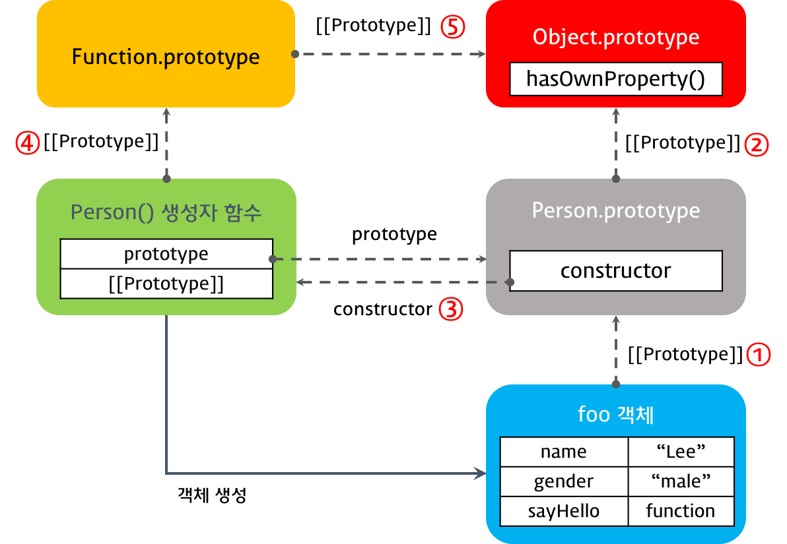

2017.08.03

# Javascript -3

## 1. 프로토타입과 객체지향

프로토타입은 부모역할을 하는 객체다. 자바스크립트의 모든 객체는 자신의 부모역할을 하는 객체와 연결돼 있다. 

```js
function Person(name) {
  this.name = name;
  this.sayHello = funcion() {
    console.log(this.name);
  } 
}
var foo = new Person('Lee');
```

```js
var student = {
  name: 'Lee',
  score: 90
};
// 문법적 설탕 개발자 편의를 위해 만들어진 방식 (객체리터럴방식)

// student에는 hasOwnProperty 메소드가 없지만 아래 구문은 동작한다.
console.log(student.hasOwnProperty('name')); // true

console.dir(student);
```

---

## 2. [[Prototype]] 프로퍼티 vs prototype 프로퍼티

[[Prototype]] 프로퍼티는 자신의 프로토타입 객체를 가리키는 숨겨진 프로퍼티이다.

[[Prototype]] 프로퍼티는 __proto__ 프로퍼티로 구현되어 있어 __proto__과 [[Prototype]]은 같은 개념이다.

함수도 객체이므로 [[Prototype]] 프로퍼티를 갖는다. 그런데 함수 객체는 일반 객체와는 달리 prototype 프로퍼티도 소유하게 된다.

```js
function Person(name) {
  this.name = name;
}

var foo = new Person('Lee');

console.dir(Person); // prototype 프로퍼티가 있다.
console.dir(foo);    // prototype 프로퍼티가 없다.
```

- [[Prototype]] 프로퍼티  
  - 함수를 포함한 모든 객체가 가지고 있는 프로퍼티이다.
  - 객체의 입장에서 자신의 부모 역할을 하는 프로토타입 객체을 가리키며 함수 객체의 경우 Function.prototype를 가리킨다. 그 이유에 대해서는 4.2 생성자 함수로 생성된 객체의 프로토타입 체인을 참조하기 바란다.

```js
console.log(Person.__proto__ === Function.prototype);
```

- prototype 프로퍼티
  - 함수 객체만 가지고 있는 프로퍼티이다.
  - 함수 객체가 생성자로 사용될 때 이 함수를 통해 생성될 객체의 부모 역할을 하는 객체(프로토타입 객체)를 가리킨다.

```js
console.log(Person.prototype === foo.__proto__);
```

---

## 3. constructor 프로퍼티

프로토타입 객체는 constructor 프로퍼티를 갖는다. 이 `constructor 프로퍼티는 객체의 입장에서 자신을 생성한 객체를 가리킨다.` Person() 생성자 함수에 의해 생성된 객체를 생성한 객체는 Person() 생성자 함수이다. 따라서 prototype 객체의 constructor 프로퍼티는 객체를 생성하는 생성자 함수 객체를 가리킨다.

```js
function Person(name) {
  this.name = name;
}

var foo = new Person('Lee');

// Person() 생성자 함수에 의해 생성된 객체를 생성한 객체는 Person() 생성자 함수이다.
console.log(Person.prototype.constructor === Person);

// foo 객체를 생성한 객체는 Person() 생성자 함수이다.
console.log(foo.constructor === Person);

// Person() 생성자 함수를 생성한 객체는 Function() 생성자 함수이다.
console.log(Person.constructor === Function);
```

---

## 4. 프로토타입 체인

자바스크립트는 특정 객체의 프로퍼티나 메소드에 접근하려고 할 때 해당 객체에 접근하려는 프로퍼티 또는 메소드가 없다면 [[Prototype]] 프로퍼티가 가리키는 링크를 따라 자신의 부모 역할을 하는 프로토타입 객체의 프로퍼티나 메소드를 차례대로 검색한다. 이것을 프로토타입 체인이라 한다.

```js
var student = {
  name: 'Lee',
  score: 90
}
console.dir(student);
console.log(student.hasOwnProperty('name')); // true
console.log(student.__proto__ === Object.prototype); // true
console.log(Object.prototype.hasOwnProperty('hasOwnProperty')); // true
```

### 4.1 객체 리터럴 방식으로 생성된 객체의 프로토타입 체인

객체 생성 방법은 3가지가 있다.

- 객체 리터럴
- 생성자 함수
- Object() 생성자 함수

객체 리터럴 방식으로 생성된 객체는 결국 내장 함수(Built-in)인 Object() 생성자 함수로 객체를 생성하는 것을 단순화시킨 것이다. 자바스크립트 엔진은 객체 리터럴로 객체를 생성하는 코드를 만나면 내부적으로 Object() 생성자 함수를 사용하여 객체를 생성한다.

Object() 생성자 함수는 물론 함수이다. 따라서 함수 객체인 Object() 생성자 함수는 일반 객체와 달리 prototype 프로퍼티가 있다.

```js
var person = {
  name: 'Lee',
  gender: 'male',
  sayHello: function(){
    console.log('Hi! my name is ' + this.name);
  }
};

console.dir(person);

console.log(person.__proto__ === Object.prototype);   // ① true
console.log(Object.prototype.constructor === Object); // ② true
console.log(Object.__proto__ === Function.prototype); // ③ true
console.log(Function.prototype.__proto__ === Object.prototype); // ④ true
```


---

### 4.2 생성자 함수로 생성된 객체의 프로토타입 체인

함수를 정의하는 방식은 3가지가 있다.

- 함수선언식(Function declaration)
- 함수표현식(Function expression)
- Function() 생성자 함수

어떤 방식으로 함수를 표현했건 간에 결국에 모든 생성자 함수는 Function() 생성자 함수로 수렴된다.

결국 함수선언식, 함수표현식 모두 함수 리터럴 방식을 사용한다. 함수 리터럴 방식은 Function() 생성자 함수로 함수를 생성하는 것을 단순화 시킨 것이다.

>즉, 3가지 함수 정의 방식은 결국 Function() 생성자 함수를 통해 함수 객체를 생성한다, 따라서 어떠한 방식으로 함수 객체를 생성하여도 모든 함수 객체의 prototype 객체는 Function.prototype이다. 생성자 함수도 함수 객체이므로 생성자 함수의 prototype 객체는 Function.prototype이다.

```js
function Person(name, gender) {
  this.name = name;
  this.gender = gender;
  this.sayHello = function(){
    console.log('Hi! my name is ' + this.name);
  };
}

var foo = new Person('Lee', 'male');

console.dir(Person);
console.dir(foo);

console.log(foo.__proto__ === Person.prototype);                // ① true
console.log(Person.prototype.__proto__ === Object.prototype);   // ② true
console.log(Person.prototype.constructor === Person);           // ③ true
console.log(Person.__proto__ === Function.prototype);           // ④ true
console.log(Function.prototype.__proto__ === Object.prototype); // ⑤ true
```



객체 리터럴 방식이나 생성자 함수 방식이나 결국은 모든 객체의 부모 객체인 Object.prototype 객체에서 프로토타입 체인이 끝나기 때문이다. 이때 `Object.prototype 객체를 프로토타입 체인의 종점(End of prototype chain)`이라 한다.

---

## 5. 프로토타입 객체의 확장

```js
function Person(name) {
  this.name = name;
}

var foo = new Person('Lee');
// foo를 객체화 시킨 후 함수 메소드를 만들어 추가해도 된다.
Person.prototype.sayHello = function(){
  console.log('Hi! my name is ' + this.name);
};

foo.sayHello();
```

생성자 함수 Person은 prototype 프로퍼티에 연결된 프로토타입 객체 Person.prototype를 갖는다. Person.prototype 객체는 일반 객체와 같이 프로퍼티를 추가/삭제가 가능하다. 위의 예에서는 Person.prototype 객체에 메소드 sayHello를 추가하였다. 이때 sayHello 메소드는 프로토타입 체인에 반영된다. 따라서 생성자 함수 Person에 의해 생성된 모든 객체는 프로토타입 체인에 의해 부모객체인 Person.prototype의 메소드를 사용할 수 있게 되었다.

---

## 6. 기본자료형(Primitive data type)의 확장

자바스크립트에서 기본자료형(숫자, 문자열, boolean, null, undefined)을 제외한 모든것은 객체이다. 그런데 아래 예제를 살펴보면 기본자료형인 문자열이 흡사 객체와 같이 동작한다.

```js
var str = 'test'; //  리터럴 방식 (값이 있는 방식) 아래 함수화 시킨 방식과 동일 결국 이방식으로 쓰는게 맞음.
console.log(typeof str);                 // string
console.log(str.constructor === String); // true
console.dir(str);

var strObj = new String('test'); // 문자열도 생성자 함수로 객체를 만들 수 있다. new 붙이고 () 붙여서. 객체인 문자열이 생성된 구문.

// 기본자료형은 원래 메소드가 없고 상속개념이 없다. 하지만 자바스크립트는 리터럴방식으로 기본자료형을 만들었을 때 .을 찍고 메소드를 쓰면 일시적으로 ㄴ객체였다가 다시 기본자료형으로 돌아온다. 객체화 시킨 스트링은 효율적인 메모리 사용이 가능해진다.

console.log(typeof strObj);                 // object
console.log(strObj.constructor === String); // true
console.dir(strObj);

console.log(str.toUpperCase());    // TEST
console.log(strObj.toUpperCase()); // TEST
```

```js
var str = 'test';

String.prototype.myMethod = function () {
  return 'myMethod';
};

// 위 방식은 조심해서 사용해야함. 따로 라이브러리, 헬퍼 등으로 만들어서 사용할 수 있도록 해야한다. 다른 개발자와 소통이 안될 수 있음. 기존 메소드를 지울 수도 있음.

console.log(str.myMethod());      // myMethod
console.log('string'.myMethod()); // myMethod
console.dir(String.prototype);
```

---

## 7. 프로토타입 객체의 변경

```js
function Person(name) {
  this.name = name;
}

var foo = new Person('Lee');

// 프로토타입 객체의 변경
Person.prototype = { gender: 'male' };

var bar = new Person('Kim');

console.log(foo.gender); // undefined
console.log(bar.gender); // 'male'

console.log(foo.constructor); // ① Person(name)
console.log(bar.constructor); // ② Object()
// 이 방법도 조심해서 사용해야 한다.
// 상속의 개념

```

---

# scope

- 전역 Scope (Global scope)
  코드 어디에서든지 참조할 수 있다.

- 지역 Scope (Local scope or Function-level scope)
  정의된 함수 내에서만 참조할 수 있다.

모든 변수는 Scope를 갖는다.

- 전역 변수 (Global variable)
  전역 Scope를 갖는 변수.

- 지역 변수 (Local variable)
  지역 Scope를 갖는 변수

`변수는 선언 위치(전역 또는 지역)에 의해 Scope`를 가지게 된다. 즉 전역에서 선언된 변수는 전역 Scope를 갖는 전역 변수이고, 지역(자바스크립트의 경우 함수 내부)에서 선언된 변수는 지역 Scope를 갖는 지역 변수가 된다.

```js
if (i < 0) coninue // 코드블록 생략된 것 continue는 지역 scope에 있는 것
```

자바스크립트는 function-level scope를 사용한다. function-level scope란 `함수 코드 블럭 내에서 선언된 변수는 함수 코드 블럭 내에서만 유효하고 함수 외부에서는 유효하지 않다`(참조할 수 없다)는 것이다. 즉 함수 블록 안에 있는 거만이 유효하다. 

```js
var x = 0;
{
  var x = 1;
  console.log(x); // 1
}
console.log(x); // 1

let y = 0;
{
  let y = 1;
  console.log(y); // 1
}
console.log(y);   // 0
```

---

## 1. Global scope

글로벌 영역에 변수를 선언하면 이 변수는 어느 곳에서든지 참조할 수 있는 global scope를 갖는 전역 변수가 된다. 전역 변수는 전역 객체(Global Object) window의 프로퍼티이다.

```js
var global = 'global';

function foo() {
  var local = 'local';  // 함수 내에 선언한 var 변수는 밖에서 참조 불가능 private
  // this. 으로 생성한 프로퍼티는 외부에서 참조할 수 이다. public
  console.log(global);
  console.log(local);
}
foo();

console.log(global);
console.log(local); // Uncaught ReferenceError: local is not defined

// window.global 의 축약형이 global
```

---

## 2. Non block-level scope

```js
if (true) {
  var x = 5; // The scope is inside the if-block , 자바스크립트는 이 안에 있는 변수는 전역변수다.
}
console.log(x); // 따라서 밖에서 참조가 가능하다.
```

변수 x는 코드 블럭 내에서 선언되었다. 하지만 자바스크립트는 block-level scope를 사용하지 않으므로 function 밖에서 선언된 `변수는 코드 블럭 내에서 선언되었다할지라도 모두 global scope을 갖게된다.` 따라서 변수 x는 전역 변수이다.

---

## 3. Function scope

```js
var a = 10;     // 전역변수

(function () {
  var b = 20;   // 지역변수
})();

console.log(a); // 10
console.log(b); // "b" is not defined
```

```js
var x = 'global';

function foo() {
  var x = 'local';
  console.log(x);
}

foo();          // local
console.log(x); // global
```

```js
var x = 'global';

function foo() {
  var x = 'local';
  console.log(x);

  function bar() {  // 내부함수 영역
    console.log(x); // ?
  }

  bar();  // local
}
foo();
console.log(x); // ?
```

내부함수는 자신을 포함하고 있는 외부함수의 변수에 접근할 수 있다. 이는 매우 유용하다. 클로저에서와 같이 내부함수가 더 오래 생존하는 경우, 타 언어와는 다른 움직임을 보인다.

함수 bar에서 참조하는 변수 x는 함수 foo에서 선언된 지역변수이다. 이는 실행 컨텍스트의 스코프 체인에 의해 참조 순위에서 전역변수 x가 뒤로 밀렸기 때문이다.

```js
var foo = function ( ) {

  var a = 3, b = 5;

  var bar = function ( ) {
    var b = 7, c = 11;

// 이 시점에서 a는 3, b는 7, c는 11

    a += b + c;

// 이 시점에서 a는 21, b는 7, c는 11

  };

// 이 시점에서 a는 3, b는 5, c는 not defined

  bar( );

// 이 시점에서 a는 21, b는 5

};
```

---

## 4. 암묵적 전역 (implied globals)

아래의 foo 함수 내 변수 x에 1을 할당하였다. 하지만 foo 함수 내에는 변수 x가 존재하지 않는다. 따라서 상위 지역(아래 예제의 경우 전역)에서 변수 x를 찾고 존재하지 않으면 변수 x를 암묵적으로 전역변수로 선언한다.

```js
function foo() {
  x = 1;   // Throws a ReferenceError in "use strict" mode
    // es6에서는 사용안해도 된다.
  var y = 2;
}

foo();

console.log(x); // 1
console.log(y); // ReferenceError: y is not defined
```

의도하지 않게 전역변수가 되었다면 혼란의 여지가 있으므로 `var keyword는 반드시 사용`하자.

---

## 5. Lexical scoping (Static scoping)

```js
var i = 5;

function foo() {
  var i = 10;
  bar();
}

function bar() { // 선언된 시점에서의 scope를 갖는다!
  console.log(i);
}

foo(); // ?
```

자바스크립트는 함수가 선언된 시점에서의 유효범위를 갖는다. 예제의 함수 bar가 어떤 상황에서 호출될 지 선언 시점에서는 알 수 없다.

---

## 6. 변수명의 중복

```js
// x.js
function foo (){
  // var i = 0;
  i = 0;
  // ...
}

// y.js
for(var i = 0; i < 5; i++){ // <-- 여기서 var i 는 전역변수
  foo();
  console.log(i);
}
```

x.js와 y.js에 모두 변수 i와 존재한다. 이는 의도되지 않은 것이다. HTML에서 이 2개의 자바스크립트 파일을 로드하여 사용하면 변수 i는 중복된다.

x.js의 변수 i는 var 키워드를 사용하지 않았으므로 암묵적으로 전역 변수화 되고 y.js의 변수 i는 전역변수이다. 이때 자바스크립트는 변수명의 중복을 허용하므로 어떠한 에러 메시지도 발생시키지 않는다. 따라서 무한 반복 상태에 빠지게 된다.

이와 같이 전역변수의 무분별한 사용은 무척 위험하다. 전역변수를 반드시 사용하여야 할 이유를 찾지 못한다면 지역변수를 사용하여야 한다. 변수의 범위인 스코프는 좁을수록 좋다.

코드가 길어지면 변수명의 중복이 발생하기 쉬워 예기치 못한 이상 동작의 원인이 되기 쉬우며, 전역변수는 지역변수보다 탐색에 걸리는 시간이 더 길다.(속도면에서 그리 큰 차이는 없지만 분명히 느리다.)

---

## 7. 최소한의 전역변수 사용

더글라스 크락포드의 제안:
전역변수 사용을 최소화하는 방법 중 하나는 애플리케이션에서 `전역변수 사용을 위해 다음과 같이 전역변수 객체 하나를 만들어 사용`하는 것이다.

```js
var MYAPP = {};

MYAPP.student = {
  name: 'Lee',
  gender: 'male'
};

console.log(MYAPP.student.name);
```

---

## 8. 즉시실행함수를 이용한 전역변수 사용 억제

전역변수 사용을 억제하기 위해, `즉시 실행 함수(IIFE, Immediately-Invoked Function Expression)를 사용할 수 있다. 이 방법을 사용하면 전역변수를 만들지 않으므로 라이브러리 등에 자주 사용`된다. 즉시 실행 함수는 즉시 실행되고 그 후 전역에서 바로 사라진다.

```js
(function () {
  var MYAPP = {};

  MYAPP.student = {
    name: 'Lee',
    gender: 'male'
  };

  console.log(MYAPP.student.name);
}());

console.log(MYAPP.student.name);
```

---

# this

this는 기본적으로 전역이다.

자바스크립트의 함수는 호출될 때, 매개변수로 전달되는 인자값 이외에, arguments 객체와 this를 암묵적으로 전달 받는다.

## 1. 함수 호출 패턴과 this 바인딩

자바스크립트의 경우 함수 호출 패턴에 따라 어떤 객체를 this에 바인딩할 지가 결정된다. 즉 함수 호출 패턴에 따라 this의 참조값이 달라진다.

함수 호출 패턴은 아래와 같다.

- 메소드 호출 패턴(Method Invocation Pattern)
- 함수 호출 패턴(Function Invocation Pattern)
- 생성자 호출 패턴(Constructor Invocation Pattern)
- apply 호출 패턴(Apply Invocation Pattern)

---

## 2. 메소드 호출 패턴(Method Invocation Pattern)

함수가 객체의 프로퍼티이면 메소드 호출 패턴으로 호출된다. 이때 메소드 내부의 `this는 해당 메소드를 소유한 객체 즉 해당 메소드를 호출한 객체에 바인딩`된다.

```js
var obj1 = {
  name: 'Lee',
  sayName: function() {
    console.log(this.name);
  }
}

var obj2 = {
  name: 'Kim'
}

obj2.sayName = obj1.sayName;

obj1.sayName();
obj2.sayName();
```

프로토타입 객체도 메소드를 가질 수 있다. 프로토타입 객체 메소드 내부에서 사용된 this도 일반 메소드 방식과 마찬가지로 해당 메소드를 호출한 객체에 바인딩된다.

---

## 3. 함수 호출 패턴(Function Invocation Pattern)

전역객체(Global Object)는 모든 객체의 유일한 최상위 객체를 의미하며 일반적으로 Browser-side에서는 window, Server-side(Node.js)에서는 global 객체를 의미한다.

```js
// in browser console
this === window // true

// in Terminal
node
this === global // true
```

```js
function foo() {
  console.log("foo's this: ",  this);  // window
  function bar() {
    console.log("bar's this: ", this); // window
  }
  bar();
}
foo();

// 기본적으로 this는 전역객체(Global object)에 바인딩된다. 전역함수는 물론이고 심지어 내부함수의 경우도 this는 외부함수가 아닌 전역객체에 바인딩된다.
```

```js
var value = 1;

var obj = {
  value: 100,
  foo: function() {
    console.log("foo's this: ",  this);  // obj
    console.log("foo's this.value: ",  this.value); // 100
    function bar() {
      console.log("bar's this: ",  this); // window
      console.log("bar's this.value: ", this.value); // 1
    } // 내부함수기 때문에 this는 전역이 된다. 이것은 자바스크립트 설계상 오류
    bar();
  }
};

obj.foo();
```

```js
var value = 1;

var obj = {
  value: 100,
  foo: function() {
    setTimeout(function() { // 콜백함수의 경우에도 this는 전역객체에 바인딩된다.
      console.log("callback's this: ",  this);  // obj
      console.log("callback's this.value: ",  this.value); // 1
    }, 100);
  }
};

obj.foo();

```

더글라스 크락포드는 “이것은 설계 단계의 결함으로 메소드가 내부함수를 사용하여 자신의 작업을 돕게 할 수 없다는 것을 의미한다” 라고 말한다. 내부함수의 this가 전역객체를 참조하는 것을 회피방법은 아래와 같다.

```js
var value = 1;

var obj = {
  value: 100,
  foo: function() {
    var that = this;  // Workaround : this === obj

    console.log("foo's this: ",  this);  // obj
    console.log("foo's this.value: ",  this.value); // 100
    function bar() {
      console.log("bar's this: ",  this); // window
      console.log("bar's this.value: ", this.value); // 1

      console.log("bar's that: ",  that); // obj
      console.log("bar's that.value: ", that.value); // 100
    }
    bar();
  }
};

obj.foo();
```

---

## 4. 생성자 호출 패턴(Constructor Invocation Pattern)

자바스크립트의 새엉자 함수는 말 그대로 객체를 생성하는 역할을 한다. 하지만 자바와 같은 객체지향 언어의 생성자 함수와는 다르게 그 형식이 정해져 있는 것이 아니라 `기존 함수에 new 연산자를 붙여서 호출하면 해당 함수는 생성자 함수로 동작한다.`

---

### 4.1 생성자 함수 동작 방식

new 연산자와 함께 생성자 함수를 호출하면 다음과 같은 수순으로 동작한다.

- 1. 빈 객체 생성 및 this 바인딩
  생성자 함수의 코드가 실행되기 전 빈 객체가 생성된다. 이 빈 객체가 생성자 함수가 새로 생성하는 객체이다. 이후 생성자 함수 내에서 사용되는 this는 이 빈 객체를 가리킨다. 그리고 생성된 빈 객체는 생성자 함수의 prototype 프로퍼티가 가리키는 객체를 자신의 프로토타입 객체로 설정한다.

- 2. this를 통한 프로퍼티 생성
  생성된 빈 객체에 this를 사용하여 동적으로 프로퍼티나 메소드를 생성할 수 있다. this는 새로 생성된 객체를 가리키므로 this를 통해 생성한 프로퍼티와 메소드는 새로 생성된 객체에 추가된다.

- 3. 생성된 객체 반환
  - 반환문이 없는 경우, this에 바인딩된 새로 생성한 객체가 반환된다. 명시적으로 this를 반환하여도 결과는 같다.
  - 반환문이 this가 아닌 다른 객체를 반환하는 경우, this가 아닌 해당 객체가 반환된다.

```js
var Person = function(name) {
  // 생성자 함수 코드 실행 전 -------- 1
  this.name = name;  // --------- 2
  // 생성된 함수 반환 -------------- 3
}

var me = new Person('Lee');
console.log(me.name);
```

---

### 4.2 객체 리터럴 방식과 생성자 함수 방식의 차이

```js
// 객체 리터럴 방식
var foo = {
  name: 'foo',
  gender: 'male'
}

console.dir(foo);

// 생성자 함수 방식
var Person = function(name, gender) {
  this.name = name;
  this.gender = gender;
}

var me  = new Person('Lee', 'male');
console.dir(me);

var you = new Person('Kim', 'female');
console.dir(you);
```

---

### 4.3 생성자 함수에 new 연산자를 붙이지 않고 호출할 경우

```js
var Person = function(name) {
  // 전역객체에 name 프로퍼티를 추가
  this.name = name;
};

// 일반 함수로서 호출되었기 때문에 객체를 생성하여 반환하지 않는다.
// 일반 함수의 this는 전역객체를 가리킨다.
var me = Person('Lee');

console.log(me); // undefined
console.log(window.name); // Lee
```

생성자 함수를 new 없이 호출한 경우, 함수 Person 내부의 this는 전역객체를 가리키므로 name은 전역변수(window)에 바인딩된다. 또한 new와 함께 생성자 함수를 호출하는 경우에 암묵적으로 반환하던 this도 반환하지 않으며, 반환문이 없으므로 undefined를 반환하게 된다.

일반함수와 생성자 함수에 특별한 형식적 차이는 없기 때문에 일반적으로 생성자 함수명은 첫문자를 대문자로 기술하여 혼란을 방지하려는 노력을 한다. 그러나 이러한 규칙을 사용한다 하더라도 실수는 발생할 수 있다.

이러한 위험성을 회피하기 위해 사용되는 패턴(Scope-Safe Constructor)은 다음과 같다. 이 패턴은 대부분의 라이브러리에서 광범위하게 사용된다.

참고로 대부분의 빌트인 생성자(Object, Regex, Array 등)는 new 연산자와 함께 호출되었는지를 확인한 후 적절한 값을 반환한다.

다시 말하지만 `new와 함께 생성자 함수를 호출하는 경우, 생성자 함수 내부의 this는 생성자 함수에 의해 생성된 인스턴스를 가리킨다. 따라서 아래 A 함수가 new 연산자와 함께 생성자 함수로 호출되면 A 함수 내부의 this는 A 생성자 함수에 의해 생성된 인스턴스를 가리킨다.`

```js
// Scope-Safe Constructor Pattern
function A(arg) {
  // 생성자 함수가 new 연산자와 함께 호출되면 함수의 선두에서 빈객체를 생성하고 this에 바인딩한다.

  /*
  this가 호출된 함수(arguments.callee, 본 예제의 경우 A)의 인스턴스가 아니면 new 연산자를 사용하지 않은 것이므로 이 경우 new와 함께 생성자 함수를 호출하여 인스턴스를 반환한다.
  arguments.callee는 호출된 함수의 이름을 나타낸다. 이 예제의 경우 A로 표기하여도 문제없이 동작하지만 특정함수의 이름과 의존성을 없애기 위해서 arguments.callee를 사용하는 것이 좋다.
  */
  if (!(this instanceof arguments.callee)) {
    return new arguments.callee(arg); // 어떤 경우에도 new를 붙여서 객체를 만든다.
  }

  this.value = arg ? arg : 0;
}

var a = new A(100); //  this 빈객체
var b = A(10);  // this 전역

console.log(a.value);
console.log(b.value);
```
**다시 한번 재확인**

---

### 4.4 apply 호출 패턴(Apply Invocation Pattern)

함수 호출 시 각 상황에 따라 this에 바인딩될 객체가 결정된다. 이는 자바스크립트 엔진 내부에서 자동으로 실시되는 것이다. 이러한 내부적인 바인딩 이외에 this를 특정 객체에 명시적으로 바인딩하는 방법도 제공된다. 이것을 가능하게 하는 것이 Function.prototype.apply(), Function.prototype.call() 메소드이다.

이 메소드들은 모든 함수 객체의 프로토타입 객체인 Function.prototype 객체의 메소드이다.

```js
func.apply(thisArg, [argsArray])
// [] 안에는 문서내에서 옵션으로 있어도 되고 없어도 되고
// 없으면 필수로 존재해야 한다.
// apply(thisArg) this로 쓸 객체
// thisArg: 함수 내부의 this에 바인딩할 객체
// argsArray: 함수에 전달할 인자 배열

```

```js
// ** 중요 **
var Person = function (name) {
  this.name = name;
};

var foo = {};

// apply 메소드는 생성자함수 Person을 호출한다. 이때 this에 객체 foo를 바인딩한다.
Person.apply(foo, ['name']); // name은 인자의 리스트
// apply는 배열로 주냐 call은 ,콤마로 그냥 주냐
// 둘의 차이는 인자의 전달방식이 다르다는 것

//Person.apply(foo, [1, 2, 3]);

// Person.call(foo, 1, 2, 3);

console.log(foo); // { name: 'name' }
```

```js
function convertArgsToArray() {
  console.log(arguments);

  // arguments 객체를 배열로 변환
  // slice: 배열의 특정 부분에 대한 복사본을 생성한다.
  var arr = Array.prototype.slice.apply(arguments); // arguments.slice
  // var arr = [].slice.apply(arguments); 둘은 똑같은 것

  console.log(arr);
  return arr;
}

convertArgsToArray(1, 2, 3);
```

Array.prototype.slice.apply(arguments)는 “Array.prototype.slice() 메소드를 호출하라. 단 this는 arguments 객체로 바인딩하라”는 의미가 된다. 결국 Array.prototype.slice() 메소드를 arguments 객체 자신의 메소드인 것처럼 arguments.slice()와 같은 형태로 호출하라는 것이다.

```js
// *이해하고 가라
function Person(name) {
  this.name = name;
}

Person.prototype.doSomething = function(callback) {
  if(typeof callback == 'function') {
    // --------- 1
    callback();
  }
};

function foo() {
  console.log(this.name); // --------- 2
}

var p = new Person('Lee');
p.doSomething(foo);  // undefined
```

1의 시점에서 this는 Person 객체이다. 그러나 2의 시점에서 this는 전역 객체 window를 가리킨다. 콜백함수를 호출하는 외부 함수 내부의 this와 콜백함수 내부의 this가 상이하기 때문에 문맥상 문제가 발생한다. 따라서 콜백함수 내부의 this를 콜백함수를 호출하는 함수 내부의 this와 일치시켜 주어야 하는 번거로움이 발생한다.

```js
function Person(name) {
  this.name = name;
}

Person.prototype.doSomething = function(callback) {
  if(typeof callback == 'function') {
    callback.call(this);
  }
};

function foo() {
  console.log(this.name);
}

var p = new Person('Lee');
p.doSomething(foo);  // 'Lee'
```

ES5에 추가된 Function.prototype.bind()를 사용하는 방법도 가능하다. 또한 ES6에서 새롭게 제공되는 Arrow function을 사용하면 call() 메소드를 사용하지 않아도 된다.

---

# SASS

## 1. 소개

Sass(Syntactically Awesome StyleSheets)는 CSS pre-processor로서 CSS의 한계와 단점을 보완하여 보다 가독성이 높고 코드의 재사용에 유리한 CSS를 생성하기 위한 CSS의 확장(extension)이다.

CSS의 간결한 문법은 배우기 쉬우며 명확하여 프로젝트 초기에는 문제가 없이 보이지만 프로젝트의 규모가 커지고 수정이 빈번히 발생함에 따라 쉽게 지저분해지고 유지보수도 어려워지는 단점도 가지고 있다.

이러한 CSS의 태생적 한계를 보완하기 위해 Sass는 다음과 같은 추가 기능과 유용한 도구들을 제공한다.

- 변수의 사용
- 조건문과 반복문
- Import
- Nesting
- Mixin
- Extend/Inheritance

CSS와 비교하여 Sass는 아래와 같은 장점이 있다.

- CSS보다 심플한 표기법으로 CSS를 구조화하여 표현할 수 있다.
- 스킬 레벨이 다른 팀원들과의 작업 시 발생할 수 있는 구문의 수준 차이를 평준화할 수 있다.
- CSS에는 존재하지 않는 Mixin 등의 강력한 기능을 활용하여 CSS 유지보수 편의성을 큰 폭으로 향상시킬 수 있다.

--- 

## 2. compile

컴파일할 SCSS 파일의 경로와 컴파일 후 생성될 css 파일의 경로를 지정한다.

```t
$ cd my-project

## 특정 파일을 특정 파일 이름으로 컴파일
## Compile foo.scss to bar.css
$ node-sass foo.scss > bar.css

## 폴더 내의 모든 파일을 컴파일
## node-sass input-folder-path -o output-folder-path
$ node-sass src/sass --output dist/css
```

---

## 3. datatype

- 숫자형
e.g) 1.2, 13, 10px

- 문자열  
  CSS는 2종류의 문자열을 사용할 수 있다. 따옴표를 사용하는 경우(“Lucida Grande”, ‘http://sass-lang.com’)와 사용하지 않는 경우(bold, sans-serif)가 있다. Sass는 2종류의 문자열 모두를 인식할 수 있으며 컴파일 후의 CSS에는 Sass에서 사용한 문자열이 그대로 출력된다.
e.g. “Lucida Grande”, ‘http://sass-lang.com’, sans-serif

- 컬러  
  e.g. blue, #04a3f9, rgba(255, 0, 0, 0.5)

- boolean  
  e.g. true, false

- null
   
- list  
  margin과 padding 프로퍼티값 지정에 사용되는 0 auto와 font-family 프로퍼티값 지정에 사용되는 Helvetica, Arial, sans-serif 등은 공백 또는 콤마 구분된 값의 list이다.
e.g. 1.5em 1em 0 2em, Helvetica, Arial, sans-serif

- map  
  JSON과 유사한 방식으로 map-get 함수를 사용하여 원하는 값은 추출할 수 있다.
  e.g. (key1: value1, key2: value2)

## 4. 변수

Sass에서는 변수를 사용할 수 있다. 문자열, 숫자, 컬러(#aa443f) 등을 사전에 변수에 저장하고 필요할 때 불러 사용할 수 있다.

변수명은 $로 시작한다.

```scss
$width: 960px;

header {
  width: $width;
  margin: 0 auto;
}

#main {
  width: $width;
  margin: 20px auto;
}

footer {
  width: $width;
  margin: 0 auto;
}
```

---

## 5. 변수의 Scope

변수에는 유효범위(scope)가 존재한다.

위의 예에서 변수 $width는 top level에 기술되었으므로 전역변수(global variable)가 된다. 전역변수는 전역은 물론 하위의 어떤 코드블럭 내에서도 유효하다.

코드블럭 내에서 선언된 변수는 지역변수(local variable)가 된다. 지역변수의 유효범위는 자신이 속한 코드블럭과 하위 코드 블럭이다.

```scss
$width: 960px; // global variable

header {
  width: $width;
  margin: 0 auto;
}

#main {
  $color: #333; // local variable
  width: $width;
  margin: 20px auto;
  section {
    p {
      color: $color;

      a:link {
        color: $color;
      }
    }
  }
}

footer {
  width: $width;
  margin: 0 auto;
  color: $color;
}
```

---

## 6. 연산자(Operation)

```scss
$width: 100px;

#foo {
  width: $width + 10; // 110px
}

#bar {
  width: $width + 10in; // 1060px
}

$width2: 100px;

#foo2 {
  width: $width2 + 10em; // NG: 100px + 10em
}
```