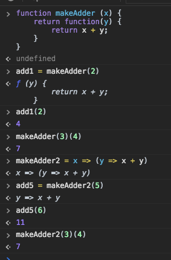

# node.js

## Middelware

- 함수, 즉 안에서 어떤 작업이든 가능
- request 객체, response 객체, next 함수를 인자로 받음
- request 객체, response 객체를 조작해서 기능 구현
- 다음 미들웨어를 동작시키기 위해 next 함수를 인자 없이 호출
- 등록된 순서대로 실행됨

```js
// 미들웨어 = 함수
function helloMiddleware(res, req, next) {
  console.log('hello')
  next()
}

app.use(helloMiddleware)
```

---

## app.use

```js
// 미들웨어를 앱 전체에서 동작하도록 주입하거나
app.use(helloMiddleware)

// 특정 경로에서만 동작하도록 주입
app.use('/some-path', helloMiddleware)

// 한 번에 여러 개 주입
app.use(middleware1, middleware2, middleware3, ...)
```

---

## 미들웨어로 하는 일

- 로깅
- HTTP body를 객체로 변환
- 사용자 인증
- 권한 관리
- 기타 등등...

---

## Why middleware?

- 미들웨어로 할 수 있는 모든 일은 라우트 핸들러에서도 할 수 있으나, 여러 라우터에서 사용해야 하는 기능을 중복 작성하는 불편을 덜고 `코드를 재사용하기 위해 미들웨어를 사용`하는 것

---

## 미들웨어 생태계

- [Express resource](https://expressjs.com/ko/resources/middleware.html)
- [NPM search](https://www.npmjs.com/search?q=express+middleware)

---

## Express 미들웨어 예제

- middlewares.js 파일에서 작성한 미들웨어를 server.js에서 불러와 사용하고 있습니다. 각각 어떤 방식으로 미들웨어를 사용하고 있는지 확인해보세요.

---

## - next?

- 미들웨어는 req, res에 더해서 next라는 함수를 추가로 인자로 받습니다. next 함수를 호출하면 다음 미들웨어로 처리를 넘기는 효과가 있습니다. 만약에 미들웨어가 next 함수를 호출하지도 않고, 응답도 보내지 않으면 클라이언트는 응답을 받지 못하게 되므로 주의하세요! `next로 호출하거나 res.send()로 실행해야 한다.`

---

## App Local, Response Local

- app.locals와 res.locals는 특별한 객체를 담고 있습니다. 템플릿에서는 res.render를 통해 명시적으로 주입받지 않아도 저 두 객체의 속성에 바로 접근할 수 있습니다.

- 템플릿을 가리지 않고 사용되는 정보들, 예를 들어 '현재 로그인 중인 사용자 정보' 같은 것을 res.render에 매번 인자로 넘기는 것은 귀찮을 뿐더러 빠뜨리기도 쉽습니다. 그런 정보들을 템플릿에서 쉽게 사용하기 위해, app.locals나 res.locals에 우리가 원하는 이름으로 속성을 주입할 수 있습니다.

- app.locals는 앱 단위로 공통적으로 쓰이는 정보를 담는 목적으로 사용됩니다. res.locals는 각 요청마다 달라지는 정보를 담는 목적으로 사용됩니다.

app.local 객체를 조작하는 것은 매우 쉽습니다. res 객체는 매 요청마다 새로 생성되어 미들웨어 바깥에서 접근할 수 있는 방법이 없으므로, res.locals를 조작하려면 미들웨어를 사용해야 합니다.

---

## currying 기법

[currying 기법](http://www.haruair.com/blog/2993)



---

## 미들웨어 vs 라우트 핸들러

- 라우트 핸들러도 미들웨어
- 즉, next 함수를 인자로 받는 것이 가능

```js
app.get('/', (req, res, next) => {
  if (!someCondition) {
    next() // 요청을 처리를 하지 않고 다른 핸들러로 넘김
  } else {
    res.send('hello')
  }
})
```

---

## 에러 처리 미들웨어

[express 에러처리 미들웨어](https://expressjs.com/ko/guide/error-handling.html)

[bugsnag](https://www.bugsnag.com)
[sentry.io](https://sentry.io/)

---

## Cookie

- 쿠키의 필요성
  - 개별 클라이언트의 여러 요청에 걸친 정보의 유지
  - 장바구니
  - 로그인/로그아웃
  - 방문 기록

---

## HTTP Cookie

- 서버가 응답을 통해 웹 브라우저에 저장하는 이름+값 형태의 정보
- 웹 브라우저는 쿠키를 저장하기 위한 저장소를 가지고 있음
- 저장소는 자료의 유효기간과 접근 권한에 대한 다양한 옵션을 제공

---

## 쿠키 전송 절차

1. 서버는 브라우저에 저장하고 싶은 정보를 응답과 같이 실어 보낸다 (Set-Cookie 헤더)

```
HTTP/1.1 200 OK
Set-Cookie: cookieName=cookieValue; Secure; Max-Age=60000
...
```

2. 브라우저는 같은 서버에 요청이 일어날 때마다 해당 정보를 요청에 같이 실어서 서버에 보낸다 (Cookie 헤더)

```
GET / HTTP/1.1
Cookie: cookieName=cookieValue; anotherName=anotherValue
...
```

---

## Set-Cookie Options

- Expires, Max-Age: 쿠키의 지속 시간 설정
- Secure: HTTPS를 통해서만 쿠키가 전송되도록 설정
- HttpOnly: 자바스크립트에서 쿠키를 읽지 못하도록 설정
- Domain, Path: 쿠키의 scope 설정 (쿠키가 전송되는 URL을 제한)

---

## Express + Cookie

- 쿠키 읽기 - req.cookies  
  요청에 실려온 쿠키가 객체로 변환되어 req.cookies에 저장됨 (cookie-parser 미들웨어 필요)

- 쿠키 쓰기 - res.cookie(name, value)  
  쿠키의 생성 혹은 수정

---

## JavaScript + Cookie

- 자바스크립트로도 쿠키를 읽고 쓰는 방법이 존재하지만, 보안 상 문제를 일으킬 수 있으므로 이런 접근 방식은 거의 사용되지 않는다.
- 자바스크립트에서 쿠키에 접근하지 못하도록 HttpOnly를 항상 설정하는 것이 best practice

---

## 쿠키의 한계점

- US-ASCII 밖에 저장하지 못함. 보통 percent encoding을 사용
- 4000 바이트 내외(영문 4000자, percent encoding 된 한글 444자 가량)밖에 저장하지 못함
- 브라우저에 저장됨. 즉, 여러 브라우저에 걸쳐 공유되어야 하는 정보, 혹은 웹 브라우저가 아닌 클라이언트(모바일 앱)에 저장되어야 하는 정보를 다루기에는 부적절

---

## Session

- 사전적 의미
  - (특정한 활동을 위한) 시간
  - (의회 등의) 회기; (법정의) 개정 (기간)

- 실질적 의미
  - 시작 조건과 종료 조건이 있는 시간, 또는 회기
  - 정보 교환이 지속되는 시간, 또는 회기

---

## 세션의 예

- HTTP session: 요청 - 응답
- 로그인 세션: 로그인 - 로그아웃
- [Google Analytics](https://support.google.com/analytics/answer/2731565?hl=ko) 세션: 페이지 접속 - 30분간 접속이 없으면 종료로 간주 (커스터마이징 가능)

---

## 웹 서비스를 위한 세션의 구현

1. 세션이 시작되면, 세션이 시작되었다는 사실을 쿠키에 저장

2. 세션에 대한 정보를 여러 요청에 걸쳐서 지속시키기 위해, 정보를 어딘가에 저장

3. 세션이 만료되면, 세션이 만료되었다는 사실을 쿠키에 반영

- 위 방식은 널리 사용되는 방식일 뿐, 반드시 위와 같이 구현해야 하는 것은 아닙니다.

---

## 세션 스토어

- 세션에 대한 정보를 저장하는 어딘가
  - 쿠키
  - 데이터베이스
  - 파일
  - 기타 정보를 저장할 수 있는 곳 어디든

---

## 세션 스토어의 선택

- 서비스의 요구사항에 맞춰서 적절한 저장소를 선택하면 됨
- 정보의 형태가 간단하고 자주 바뀔 일이 없으면 쿠키
- 저장해야 할 정보의 양이 많으면 데이터베이스 
- 정보가 굉장히 자주 변경되면 메모리 기반 저장소

---

## 세션? 세션 스토어?

- '세션'과 '세션 스토어'는 엄연히 다른 말이지만 혼용되는 경우가 많습니다.
- '세션에 정보를 저장한다'는 말은 `'세션 스토어에 정보를 저장한다'`는 말과 같은 뜻이라고 생각하면 됩니다.

---

## Express + Session

- [cookie-session](https://www.npmjs.com/package/cookie-session)
  - 쿠키에 모든 정보를 저장하는 세션 스토어. 
  - 첫 방문시 무조건 세션 시작
- [express-session](https://www.npmjs.com/package/express-session)
  - 쿠키에는 세션 식별자만 저장하고 실제 정보의 저장은 외부 저장소(데이터베이스 등)를 이용하는 세션 스토어. 외부 저장소에 대한 별도의 설정 필요
