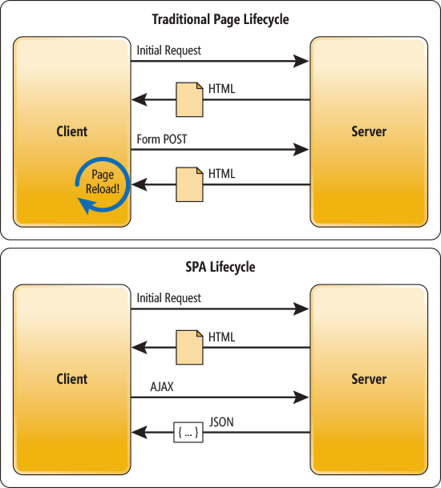

# node.js

## Cache

### 1.(무기 등의) 은닉처

### 2.은닉하다

- 컴퓨터 분야에서의 캐시는 (주로 접근 속도의 개선을 위해) 데이터를 미리 복사해 놓는 임시 저장소, 혹은 그 임시 저장소에 데이터를 저장하는 행위를 가리킴
- 'cache' 혹은 'caching'이라는 용어 자체는 특정 기술을 가리키는 것이 아니라, 접근 속도를 개선하기 위해 따로 저장소를 두는 '방법'을 가리킴
- 컴퓨터의 아주 많은 부분(CPU, GPU, HDD, 네트워크, 웹, 데이터베이스...)에서 사용되고 있음

---

## HTTP Cache

자원의 효율적 로딩을 위한 웹 표준
서버에서 가져온 자원(HTML, CSS, JS, 이미지, ...)을 가까운 곳(브라우저, 혹은 다른 서버)에 저장해놓고 재사용
캐시를 할 것인지 말 것인지, 어떻게 할 것인지를 결정하는 규칙이 복잡하고, 브라우저마다 조금씩 다름

---

## Common Problem

- `캐시된 자원`과 `실제 자원의 내용이 달라지는 문제`를 
어떻게 해결할 것인가?

---

## Solution

- Expiration (만료)
  - 정해진 시간이 지나면 캐시가 자동으로 삭제되도록 설정
- Validation (검증)
  - 서버에 요청을 보내서 캐시를 계속 사용할 수 있는지 확인

---

## Cache 관련 헤더

- Cache 범주
  - Cache-Control  
    (요청, 응답) 캐시와 관련된 다양한 기능을 하는 지시자를 포함. no-cache, max-age가 많이 사용됨. no-cache, max-age=0 지시자는 캐시를 사용하지 않도록 하거나, 캐시를 아직도 쓸 수 있는지 검증하기 위해 사용됨 (각각의 자세한 의미)
  - Expires  
  (응답) 캐시를 만료시킬 시각을 서버에서 명시적으로 지정
- Conditionals 범주
  - ETag  
  (응답) 캐시의 검증을 위해 사용되는 자원의 식별자. 주로 자원의 해시값이 사용되나, 마지막으로 수정된 시각, 혹은 버전 넘버를 사용하기도 함
  - Last-Modified  
  (응답) 원래 자료가 마지막으로 수정된 시각
  - If-None-Match  
  - (요청) 검증을 위해 사용됨. 이전에 저장해두었던 자원의 ETag 값을 If-None-Match 헤더의 값으로 요청에 포함시켜서 보내면, 서버는 해당 경로에 있는 자원의 ETag와 비교해보고 자원의 전송 여부를 결정
  - If-Modified-Since  
  (요청) 검증을 위해 사용됨. 이전에 저장해두었던 자원의 Last-Modified 값을 If-Modified-Since 헤더의 값으로 요청에 포함시켜서 보내면, 서버는 해당 경로에 있는 자원의 Last-Modified와 비교해보고 자원의 전송 여부를 결정

- 304 상태코드는 header만 통신하고 html은 요청/응답을하지 않는다. post는 304 상태코드를 반환하지 않는다. 캐쉬를 사용하지 않기 때문에

---

## Cacheable Methods

- POST 메소드는 Cacheable 범주에 포함되기는 하지만, 특별한 조건을 만족시켜야 하며 실무에서는 POST cache가 거의 사용되지 않습니다.

---

## 캐시의 사용

- 브라우저는 이미 캐시를 잘 활용하도록 만들어져 있습니다.
- Express는 이미 캐시를 잘 활용하도록 만들어져 있습니다.
- 오예!
- 일단은 별다른 추가작업 없이도 편하게 캐시 기능을 사용할 수 있지만, 우리가 원하는대로 캐시가 동작하지 않을 때 그 원인을 파악하기 위해 캐시 관련 헤더는 숙지해두는 것이 좋습니다. 그리고 HTTP method를 용도에 맞게 사용하는 것도 중요합니다.

---

# GraphQL

## REST API의 단점

- 각각의 자원마다 경로가 따로 있음. 즉, 여러 자원이 동시에 필요한 경우에는 요청을 여러 번 보내야 함 (요청의 횟수 면에서 비효율적)
- (보통의 경우) 자원의 필요한 속성만 얻어올 수 없음. 즉, 일부 속성의 필요하더라도 전체 속성을 가져와야만 함 (요청의 용량 면에서 비효율적)

---

## GraphQL

- Facebook에서 2015년 공개한 데이터 질의 언어
- REST API를 대체하기 위해 만들어짐
- 클라이언트에서 필요한 데이터의 구조를 GraphQL 언어로 정의한 후 질의할 수 있고, 서버는 그에 맞게 구조화된 데이터를 응답
- 서버에서는 GraphQL 질의를 해석하기 위해 별도의 해석기가 필요하며, 여러 언어의 구현체가 나와있는 상태
- [GraphQL 연습](https://developer.github.com/v4/explorer)
---

# Single Page Application

## SPA 구조

---